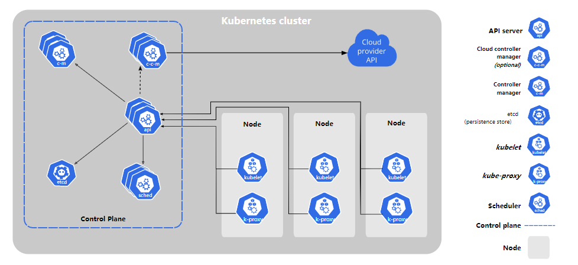
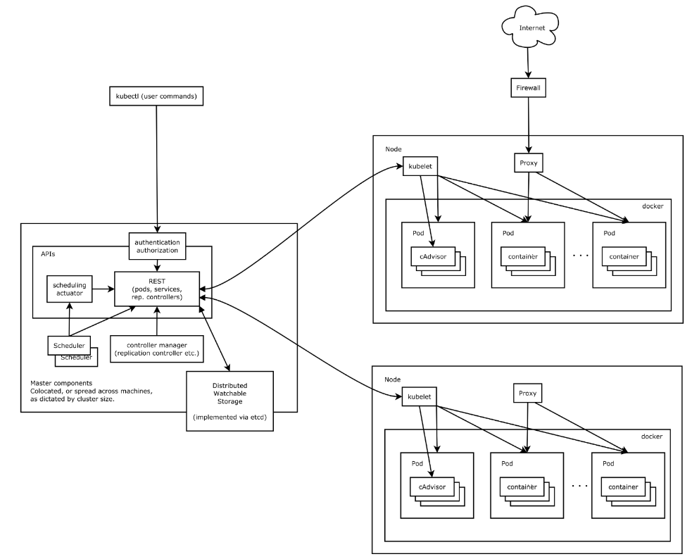

[TOC]

# kubernetes 组件
[REFERENCE](https://kubernetes.io/zh/docs/concepts/overview/components/)





## Master 节点

### kube-apiserver
> 总体来看，Kubernetes API Server 的核心功能是提供了 Kubernetes 各类资源对象 (如 Pod、RC、Service等) 的增、删、改、查及Watch 等 HTTP Rest接口，成为集群内各个功能模块之间数据交互和通信的中心枢纽，是整个的数据总线和数据中心。大部分操作都可以通过 kubectl 命令行接口或 类似 kubeadm 这类命令行工具来执行， 这些工具在背后也是调用 API。不过，你也可以使用 REST 调用来访问这些 API。

除此之外，它还有以下一些功能特性。
- 是集群管理的API入口
- 是资源配额控制的入口
- 提供了安全的集群安全机制

```shell
# 查看 api 的版本
kubectl api-versions

# 查看所有 api 资源
kubectl api-resources

# 查看某个 api 资源的一级字段
kubectl explain pods

# 查看某个 api 资源的所有字段
kubectl explain pods --recursive
```

### etcd
> etcd 是兼具一致性和高可用的键值数据库，可以作为保存 kubernetes 所有集群数据的后台数据库。需要备份。[etcd 文档](https://etcd.io/docs/)

### kube-controller-manager
> 从逻辑上讲，每个控制器都是一个单独的进程，但是为了降低复杂性，它们都被编译到同一个可执行文件，并在一个进程中运行。Controller Manager 作为集群内部的管理控制中心，负责集群内的 Node、Pod 副本、服务端点（Endpoint）、命名空间（Namespaces）、服务器帐号（ServiceAccount）、资源定额（ResourceQuota）等的管理，当某个Node 意外宕机时，Controller Manager 会及时发现此故障并执行自动化修复，确保集群始终处理预期的工作状态。

这些控制器包括：
- 节点控制器（Node Controller）：负责在节点出现故障时进行通知和响应
- 副本控制器（Replication Controller）：负责为系统中的每个副本控制器对象维护正确数量的 Pod
- 端点控制器（Endpoints Controller）：填充端点（Endpoints）对象（即加入 Service 与 Pod）
- 服务账户和令牌控制器（Service Account & Token Controllers）：为新的命名空间创建默认账户和API 访问令牌

### kube-scheduler
> 负责监视新创建的、未指定运行节点（node）的 Pods，选择节点让 Pod 在上面运行。调度策略考虑的因素包括单个 Pod 和 Pod集合的资源需求、硬件/软件/策略约束、亲和性和反亲和性、数据位置、工作负载的干扰和最后时限。Kubernetes Scheduler 在整个系统中承担了 "承上启下" 的重要功能，"承上" 是指它负责接收 Controller Manager 创建的新 Pod，为其安排一个落脚的 "家" ----目标 Node，"启下" 是指安置工作完成后，目标 Node 上的 kubelet 服务进程接管后继续工作，负责 Pod 生命周期中的 "下半生"。Kubernetes Scheduler 的作用是将待调度的 Pod （API新创建的 Pod、Controller Manager 为补足副本而创建的 Pod等）按照特定的调度算法和调度策略绑定（Binding）到集群中的某个合适的 Node 上，并将绑定信息写入 etcd 中。在整个调度过程中涉及三个对象，分别是：待调度 Pod 列表、可用 Node 列表 以及调度算法和策略。就是通过调度算法为待调度的 Pod 列表中的每个 Pod 从 Node 列表中选择一个最适合的 Node。随后节点上的 kubelet 通过 API Server 监听到 Kubernetes Scheduler 产生的 Pod 绑定时间，然后获取对应的 Pod 清单，下载 Image 镜像，并启动容器。

Kubernetes Scheduler 调度流程分为以下两步：
- 预选调度过程，即遍历所有目标 Node，筛选出符合要求的候选节点。为此 Kubernetes 内置了多种预选策略供用户选择
- 确定最后节点，在第1步的基础上，采用优选策略计算出每个候选节点的积分，积分最高者胜出。

## Node 节点
节点组件在每个节点上运行，维护运行的 Pod 并提供 kubernetes 运行环境。节点的字段信息 [Node 文档](https://kubernetes.io/zh/docs/concepts/architecture/nodes/)

```shell
# 查看节点状态
kubectl describe node docker-k8s01

# 标记节点不可调度
kubectl cordon docker-k8s01
```

### kubelet
> 一个在集群中每个节点（node）上运行的代理。它保证容器（containers）都运行在 Pod 中。kubelet 接收一组通过各类机制提供给它的 PodSpecs，确保这些 PodSpecs 中描述的容器处于运行状态且健康。kubelet 不会管理不是由 kubernets 创建的容器。

### kube-proxy
> kube-proxy 是集群中每个节点上运行的网络代理，实现 kubernetes 服务（service）概念的一部分。kube-proxy 维护节点上的网络规则。这些网络规则允许从集群内部或外部的网络会话与 Pod 进行网络通信。

### Container runtime
> 容器运行环境是负责运行容器的软件。kubernetes 支持多个容器运行环境：Docker、containerd、CRI-O 以及任何实现 kubernetes CRI  [容器运行环境接口](https://github.com/kubernetes/community/blob/master/contributors/devel/sig-node/container-runtime-interface.md)

### Addons（插件）

> 插件实用 kubernetes 资源（DaemonSet、Deployment等）实现集群功能。因为这些插件提供集群级别的功能，插件中命名空间域 的资源属于 kube-system 命名空间。如 DNS、Web UI（Dashboard）、Container Resource Monitoring等等。[具体参考](https://kubernetes.io/zh/docs/concepts/cluster-administration/addons/)


