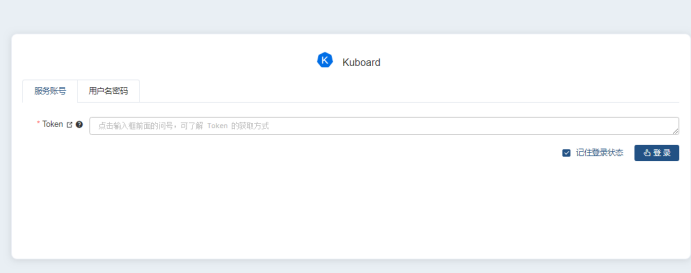
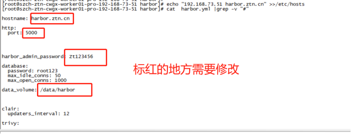

# K8S平台部署文档

#  硬件资源

| 服务器名称       | 用途                     | 机器类型 | CPU核数 | 内存/G | 系统盘/G | 数据盘/G      | 服务器IP      |
| ---------------- | ------------------------ | -------- | ------- | ------ | -------- | ------------- | ------------- |
| K8S的master节点1 | 生产work应用节点服务器   | 虚拟机   |         |        |          |               | 192.168.73.31 |
| K8S的master节点2 | 虚拟机                   |          |         |        |          | 192.168.73.32 |               |
| K8S的master节点3 | 虚拟机                   |          |         |        |          | 192.168.73.33 |               |
| nginx节点1       | 生产应用master节点服务器 | 虚拟机   |         |        |          |               | 192.168.73.34 |
| nginx节点2       | 虚拟机                   |          |         |        |          | 192.168.73.35 |               |
| VIP              | K8S的master节点的VIP     |          |         |        |          |               | 192.168.73.57 |


#  K8S集群

## 2.1部署架构

 

本次方 案采用使用三主多从的高可用方案：

Kubernetes的管理层服务包括kube-scheduler和kube-controller-manager。kube-scheduer和kube-controller-managerKubernetes中实现了一套简单的选主逻辑，依赖Etcd实现scheduler和controller-manager的选主功能。

如果scheduler和controller-manager在启动的时候设置了leader-elect参数，它们在启动后会先尝试获取leader节点身份，只有在获取leader节点身份后才可以执行具体的业务逻辑。它们分别会在Etcd中创建kube-scheduler和kube-controller-manager的endpoint，endpoint的信息中记录了当前的leader节点信息，以及记录的上次更新时间。leader节点会定期更新endpoint的信息，维护自己的leader身份。每个从节点的服务都会定期检查endpoint的信息，如果endpoint的信息在时间范围内没有更新，它们会尝试更新自己为leader节点。scheduler服务以及controller-manager服务之间不会进行通信，利用Etcd的强一致性，能够保证在分布式高并发情况下leader节点的全局唯一性。

## 2.2部署规划主机列表

| 主机名 | Centos版本 | ip | docker version | flannel version | Keepalived version | kubelet version | 备注     |
| ---------------- | -------------------- | ------------ | ------------------------ | ------------------------- | ---------------------------- | ------------------------- | ------------------ |
| master01         | 7.6                  | /            | 19.3.15                  | v0.11.0                   | /                            | v1.19.6                   | control plane/etcd |
| master02         | 7.6                  | /            | 19.3.15                  | v0.11.0                   | /                            | v1.19.6                   | control plane/etcd |
| master03         | 7.6                  | /            | 19.3.15                  | v0.11.0                   | /                            | v1.19.6                   | control plane/etcd |
| work01           | 7.6                  | /            | 19.3.15                  | /                         | /                            | v1.19.6                   | worker nodes       |
| work02           | 7.6                  | /            | 19.3.15                  | /                         | /                            | v1.19.6                   | worker nodes       |
| work03           | 7.6                  | /            | 19.3.15                  | /                         | /                            | v1.19.6                   | worker nodes       |
| VIP              | /                    | /            | /                        | /                         | v1.3.5                       | /                         | master节点控制     |
| VIP              | /                    | /            | /                        | /                         | v1.3.5                       | /                         | node节点控制       |

 

### 2.2.1 修改主机名(无需操作)

```shell
hostnamectl set-hostname master01
```

### 2.2.2内核升级4.17（根据实际情况可选项操作）

```shell
# 下载centos7.6对应的内核版本 -- 来源阿里云
wget http://192.168.73.43/soft/kernel-4.9.86-30.el7.x86_64.rpm

# 查看内核版本
awk -F\' '$1=="menuentry " {print i++ ":" $2}' /etc/grub2.cfg

# 设置开机启动项
grub2-set-default 'CentOS Linux (4.9.86-30.el7.x86_64) 7 (Core)'

# 重启机器检测
reboot

```

### 2.2.3禁用swap
```shell
# 临时禁用
swapoff -a

# 若需要重启后也生效，在禁用swap后还需修改配置文件/etc/fstab，注释swap
sed -i.bak '/swap/s/^/#/' /etc/fstab
```

### 2.2.4 br_netfilter模块加载
```shell
# k8s网络使用flannel，该网络需要设置内核参数bridge-nf-call-iptables=1，修改这个参数需要系统有br_netfilter模块。查看br_netfilter模块：
lsmod |grep br_netfilter

# 如果系统没有br_netfilter模块则执行下面的新增命令，如有则忽略。永久新增br_netfilter模块：

cat > /etc/rc.sysinit << EOF
#!/bin/bash
for file in /etc/sysconfig/modules/*.modules ; do
[ -x $file ] && $filedone
EOF

cat > /etc/sysconfig/modules/br_netfilter.modules << EOF
modprobe br_netfilter
EOF

chmod 755 /etc/sysconfig/modules/br_netfilter.modules
```

### 2.2.5内核参数永久修改
```shell
cat <<EOF >  /etc/sysctl.d/k8s.conf
net.bridge.bridge-nf-call-ip6tables = 1
net.bridge.bridge-nf-call-iptables = 1
EOF

sysctl -p /etc/sysctl.d/k8s.conf
```


## 2.3 设置kubernetes源
```shell
cat <<EOF > /etc/yum.repos.d/kubernetes.repo[kubernetes]
name=Kubernetes
baseurl=https://mirrors.aliyun.com/kubernetes/yum/repos/kubernetes-el7-x86_64/
enabled=1
gpgcheck=1
repo_gpgcheck=1
gpgkey=https://mirrors.aliyun.com/kubernetes/yum/doc/yum-key.gpg https://mirrors.aliyun.com/kubernetes/yum/doc/rpm-package-key.gpg
EOF

yum -y makecache
```

## 2.4 免密登录（无需操作）
```shell
# 配置master01到master02免密登录，本步骤只在master01上执行。
ssh-keygen -t rsa
ssh-copy-id -i /root/.ssh/id_rsa.pub root@172.27.34.36
```


## 2.5 Docker安装
```shell
# Docker 配置yum源
yum install -y yum-utils  device-mapper-persistent-data  lvm2
yum-config-manager --add-repo https://mirrors.aliyun.com/docker-ce/linux/centos/docker-ce.repo

yum makecache

# Docker安装版本查看
yum list docker-ce --showduplicates | sort -r

# 安装的docker版本
yum install docker-ce-19.03.15 docker-ce-cli-19.03.15 containerd.io -y

cat <<EOF | sudo tee /etc/docker/daemon.json
{
 "registry-mirrors": ["https://n0slxpfe.mirror.aliyuncs.com"],
 "exec-opts": ["native.cgroupdriver=systemd"],
 "log-driver": "json-file",
 "log-opts": {
 "max-size": "100m", "max-file":"3"
 },
 "storage-driver": "overlay2",
 "storage-opts": [
  "overlay2.override_kernel_check=true"
 ]
}
EOF

systemctl daemon-reload
systemctl start docker && systemctl enable docker

# 修改docker数据文件的默认存储位置
mv /var/lib/docker /data
ln -s /data/docker /var/lib/docker
systemctl start docker
```

## 2.6 安装bash-completion
```shell
yum -y install bash-completion
echo 'source <(kubectl completion bash)' >>~/.bashrc
source /etc/profile.d/bash_completion.sh
```


## 2.7 配置镜像加速
```shell
# 配置daemon.json文件
mkdir -p /etc/docker

tee /etc/docker/daemon.json <<-'EOF' 
{ 
 "exec-opts": ["native.cgroupdriver=systemd"],
 "registry-mirrors": ["https://docker.zwxict.com","https://v16stybc.mirror.aliyuncs.com"],
 "log-driver": "json-file",
 "log-opts": {"max-size":"350m", "max-file":"3"}
}
EOF

# 重启服务
systemctl daemon-reload
systemctl restart docker
```

## 2.8开启 ipvs
```shell
# 添加ipvs支持 
yum install -y nfs-utils ipset ipvsadm

cat > /etc/sysconfig/modules/ipvs.modules <<EOF
#!/bin/bash
modprobe -- ip_vs
modprobe -- ip_vs_rr
modprobe -- ip_vs_wrr
modprobe -- ip_vs_sh
modprobe -- nf_conntrack_ipv4
EOF

chmod 755 /etc/sysconfig/modules/ipvs.modules && bash /etc/sysconfig/modules/ipvs.modules && lsmod | grep -e ip_vs -e nf_conntrack_ipv4
```


## 2.9 NGINX+ KEEPALIVED（k8s的master的API负载）

### 2.9.1 keepalived安装
```shell
# master01 master02 两台主机操作
yum -y install keepalived
```

### 2.9.2 keepalived配置
```shell
# nginx01配置,配置是去掉ipvs的负载均衡,做高可用HA
vim /etc/keepalived/keepalived.conf
vrrp_instance VI_1 {
 state MASTER   #BACKUP上修改为BACKUP
 interface ens192 #主网卡信息
 virtual_router_id 44  #虚拟路由标识，主从相同
 priority 100
 advert_int 1
 authentication {
 auth_type PASS
 auth_pass Zt123456  #主从认证密码必须一致
 }
 virtual_ipaddress {  #虚拟IP（VIP）
 192.168.73.57
 }
}

# nginx02 配置
vim /etc/keepalived/keepalived.conf
vrrp_instance VI_1 {
 state BACKUP  #BACKUP上修改为BACKUP
 interface ens192
 virtual_router_id 44  #虚拟路由标识，主从相同
 priority 80  #权重
 advert_int 1
 authentication {
 auth_type PASS
 auth_pass Zt123456  #主从认证密码必须一致
 }
 virtual_ipaddress {  #虚拟IP（VIP）
 192.168.73.57
 }
}
```


### 2.9.3 keepalived启动服务
```shell
systemctl start keepalived
systemctl enable keepalived
systemctl status keepalived
```

### 2.9.4 nginx 安装
```shell
# 配置yum安装
rpm -Uvh http://nginx.org/packages/centos/7/noarch/RPMS/nginx-release-centos-7-0.el7.ngx.noarch.rpm

yum install -y nginx

# Nginx配置

cat /etc/nginx/nginx.conf
user nginx;
worker_processes auto;
error_log /var/log/nginx/error.log;
pid /run/nginx.pid;
include /usr/share/nginx/modules/*.conf;
events {
  worker_connections 1024;
}

#把HTTP服务都删掉  http{  }
stream {
  upstream kube-apiserver {
     server 192.168.73.31:6443   max_fails=3 fail_timeout=30s;
     server 192.168.73.32:6443   max_fails=3 fail_timeout=30s;
     server 192.168.73.33:6443   max_fails=3 fail_timeout=30s;
  }

  server {
     listen 7443;
     proxy_connect_timeout 2s;
     proxy_timeout 900s;
     proxy_pass kube-apiserver;
  }
}

nginx -t
nginx: the configuration file /etc/nginx/nginx.conf syntax is ok
nginx: configuration file /etc/nginx/nginx.conf test is successful
```

### 2.9.4 nginx 启动服务
```shell
systemctl start nginx
systemctl enable nginx
systemctl status nginx
```

## 2.10高可用etcd集群(无需操作)

### 2.10.1在master1上安装cfssl
```shell
wget https://pkg.cfssl.org/R1.2/cfssl_linux-amd64

wget https://pkg.cfssl.org/R1.2/cfssljson_linux-amd64

chmod +x cfssl_linux-amd64 cfssljson_linux-amd64

mv cfssl_linux-amd64 /usr/local/bin/cfssl

mv cfssljson_linux-amd64 /usr/local/bin/cfssljson

export PATH=$PATH:/usr/local/bin
```

### 2.10.2安装etcd二进制文件
```shell
# 创建目录
mkdir -p /data/etcd/bin

# 下载
cd /tmp
wget https://storage.googleapis.com/etcd/v3.3.25/etcd-v3.3.25-linux-amd64.tar.gz
tar zxf etcd-v3.3.25-linux-amd64.tar.gz
cd etcd-v3.3.25-linux-amd64
mv etcd etcdctl /data/etcd/bin/
```

### 2.10.3创建ca证书，客户端，服务端，节点之间的证书
```shell
Etcd属于server ,etcdctl 属于client，二者之间通过http协议进行通信。ca证书 自己给自己签名的权威证书，用来给其他证书签名server证书 etcd的证书,client证书 客户端，比如etcdctl的证书,peer证书 节点与节点之间通信的证书

# 创建目录
mkdir -p /data/etcd/ssl

cd /data/etcd/ssl

# 创建ca证书
vim ca-config.json
{
  "signing": {
    "default": {
      "expiry": "438000h"
    },
    "profiles": {
      "server": {
        "expiry": "438000h",
        "usages": [
          "signing",
          "key encipherment",
          "server auth",
          "client auth"
        ]
      },
      "client": {
        "expiry": "438000h",
        "usages": [
          "signing",
          "key encipherment",
          "client auth"
        ]
      },
      "peer": {
        "expiry": "438000h",
        "usages": [
          "signing",
          "key encipherment",
          "server auth",
          "client auth"
        ]
      }
    }
  }
}

# server auth表示client可以用该ca对server提供的证书进行验证

# client auth表示server可以用该ca对client提供的证书进行验证

# 创建证书签名请求ca-csr.json

vim ca-csr.json
{
  "CN": "etcd",
  "key": {
    "algo": "rsa",
    "size": 2048
  }
}
```

### 2.10.4生成CA证书和私钥
```shell
cfssl gencert -initca ca-csr.json | cfssljson -bare ca
ls ca*
ca-config.json ca.csr ca-csr.json ca-key.pem ca.pem
​```shell

### 2.10.5生成客户端证书
​```shell
vim client.json
{
  "CN": "client",
  "key": {
    "algo": "ecdsa",
    "size": 256
  }
}

# 生成证书

cfssl gencert -ca=ca.pem -ca-key=ca-key.pem -config=ca-config.json -profile=client client.json  | cfssljson -bare client -

ls ca*
ca-config.json ca.csr ca-csr.json ca-key.pem ca.pem client-key.pem client.pem
```

### 2.10.6生成etcd服务server和peer证书
```shell
# 创建配置 
vim etcd.json
{
  "CN": "etcd",
  "hosts": [
    "192.168.73.33",
    "192.168.73.34",
    "192.168.73.35"
  ],
  "key": {
    "algo": "ecdsa",
    "size": 256
  },
  "names": [
    {
      "C": "CN",
      "L": "BJ",
      "ST": "BJ"
    }
  ]
}

# 生成证书

cfssl gencert -ca=ca.pem -ca-key=ca-key.pem -config=ca-config.json -profile=server etcd.json | cfssljson -bare server

cfssl gencert -ca=ca.pem -ca-key=ca-key.pem -config=ca-config.json -profile=peer etcd.json | cfssljson -bare peer
```

### 2.10.7证书同步另外两个节点
```shell
# 将master01的/data/etcd/ssl目录同步到master02和node01上

scp -r /data/etcd 192.168.100.242:/data/etcd
scp -r /data/etcd 192.168.100.243:/data/etcd
```

### 2.10.8 systemd配置文件
```shell
# 三台主机配置不一样用的时候把注释最好删除
vim /usr/lib/systemd/system/etcd.service
[Unit]
Description=Etcd Server
After=network.target
After=network-online.target
Wants=network-online.target
Documentation=https://github.com/coreos

[Service]
Type=notify
WorkingDirectory=/data/etcd/
ExecStart=/data/etcd/bin/etcd \
 --name=etcd1 \    # 这里须要改
 --cert-file=/data/etcd/ssl/server.pem \
 --key-file=/data/etcd/ssl/server-key.pem \
 --peer-cert-file=/data/etcd/ssl/peer.pem \
 --peer-key-file=/data/etcd/ssl/peer-key.pem \
 --trusted-ca-file=/data/etcd/ssl/ca.pem \
 --peer-trusted-ca-file=/data/etcd/ssl/ca.pem \
 --initial-advertise-peer-urls https://192.168.100.241:2380 \  # 改为本机ip
 --listen-peer-urls https://192.168.100.241:2380 \  # 改为本机ip
 --listen-client-urls https://192.168.100.241:2379 \  # 改为本机ip
 --advertise-client-urls https://192.168.100.241:2379 \  # 改为本机ip
 --initial-cluster-token=etcd-cluster-0 \
 --initial-cluster etcd1=https://192.168.100.241:2380,etcd2=https://192.168.100.242:2380,etcd3=https://192.168.100.243:2380 \
 --initial-cluster-state=new \
 --data-dir=/data/etcd \
 --snapshot-count=50000 \
 --auto-compaction-retention=1 \
 --max-request-bytes=10485760 \
 --quota-backend-bytes=8589934592

Restart=always
RestartSec=15
LimitNOFILE=65536
OOMScoreAdjust=-999

[Install]
WantedBy=multi-user.target
```

### 2.10.9 启动 etcd
```shell
systemctl daemon-reload
systemctl enable etcd
systemctl start etcd
systemctl status etcd
```

### 2.10.10验证是否成功
```shell
cd /data/etcd/ssl

# 查看状态

../bin/etcdctl --ca-file=ca.pem --cert-file=server.pem --key-file=server-key.pem --endpoints="https://192.168.73.34:2379" cluster-health

# 查看集群主机

../bin/etcdctl --ca-file=ca.pem --cert-file=server.pem --key-file=server-key.pem --endpoints="https://192.168.100.241:2379" member list
```

## 2.11 K8s安装
```shell
# 安装的kubelet版本是1.19.6
yum install -y kubelet-1.19.6 kubeadm-1.19.6 kubectl-1.19.6
systemctl enable kubelet 
```

## 2.12 K8s镜像从阿里云下载到本地
> 此步可以其他方式实现
```shell
kubeadm config images list |sed -e 's/^/docker pull /g' -e 's#k8s.gcr.io#docker.io/registry.cn-hangzhou.aliyuncs.com/k8sxio#g' |sh -x		

docker images |grep k8sxio |awk '{print "docker tag ",$1":"$2,$1":"$2}' |sed -e 's#registry.cn-hangzhou.aliyuncs.com/k8sxio#k8s.gcr.io#2' |sh -x

docker images |grep k8sxio |awk '{print "docker rmi ", $1":"$2}' |sh -x
```

### 2.12.1初始化Master1
```shell
# 只在第一个 master 节点执行，Apiserver 第一个master为本地地址，后续两台master配置keepalived的VIP地址，Kubernetes 容器组所在的网段，该网段安装完成后，由 kubernetes 创建，事先并不存在于您的物理网络中

echo "127.0.0.1  apiserver" >> /etc/hosts

#初始化第一台master节点

kubeadm init --pod-network-cidr=10.244.0.0/16 --control-plane-endpoint "apiserver:6443" --upload-certs --kubernetes-version=v1.19.6

# 配置kubectl，要使用 kubectl来 管理集群操作集群，需要做如下配置：

mkdir -p $HOME/.kube
sudo cp -i /etc/kubernetes/admin.conf $HOME/.kube/config
sudo chown $(id -u):$(id -g) $HOME/.kube/config
```

### 2.12.2修改kube-proxy 使用ipvs的方式
```shell
# Linux 内核需升级4.1版本以上
kubectl edit cm kube-proxy -n kube-system

# 重启kube-proxy
kubectl get pod -n kube-system | grep kube-proxy | awk '{system("kubectl delete pod "$1" -n kube-system")}'
```

### 2.12.3初始master文件配置文件方法（无需操作）
```shell
# 生成默认配置文件
kubeadm config print init-defaults > kubeadm-init.yaml

# 最后修改后
apiVersion: kubeadm.k8s.io/v1beta2
bootstrapTokens:
 - groups:
 - system:bootstrappers:kubeadm:default-node-token
 token: abcdef.0123456789abcdef
 ttl: 24h0m0s
 usages:
  - signing
  - authentication
kind: InitConfiguration
localAPIEndpoint:
 advertiseAddress: 192.168.100.241  # 本机ip
 bindPort: 6443
nodeRegistration:
 criSocket: /var/run/dockershim.sock
 name: master01  # 本机hostname
 taints:
  - effect: NoSchedule
  key: node-role.kubernetes.io/master
---
apiServer:
 timeoutForControlPlane: 4m0s
apiVersion: kubeadm.k8s.io/v1beta2
certificatesDir: /etc/kubernetes/pki
clusterName: kubernetes
controllerManager: {}
dns:
 type: CoreDNS
etcd: 
#  local:
#   dataDir: /var/lib/etcd  # 下面为自定义etcd集群
 external:
  endpoints:
  - https://192.168.73.33:2379
  - https://192.168.73.34:2379
  - https://192.168.73.35:2379
  caFile: /etc/kubernetes/pki/etcd/ca.pem  #搭建etcd集群时生成的ca证书
  certFile: /etc/kubernetes/pki/apiserver-etcd-client.pem  #搭建etcd集群时生成的客户端证书
  keyFile: /etc/kubernetes/pki/apiserver-etcd-client-key.pem  #搭建etcd集群时生成的客户端密钥
imageRepository: registry.cn-hangzhou.aliyuncs.com/google_containers
kind: ClusterConfiguration
kubernetesVersion: v1.19.6
controlPlaneEndpoint: 192.168.73.51 # vip地址
networking:
 dnsDomain: cluster.local
 podSubnet: 10.244.0.0/16
 serviceSubnet: 10.96.0.0/12
scheduler: {}
---
apiVersion: kubeproxy.config.k8s.io/v1alpha1
kind: KubeProxyConfiguration
mode: "ipvs"

# 执行初始化
kubeadm init --config=kubeadm-init.yaml
```


### 2.12.4 配置kubectl
```shell
# 要使用 kubectl来 管理集群操作集群，需要做如下配置：
mkdir -p $HOME/.kube
sudo cp -i /etc/kubernetes/admin.conf $HOME/.kube/config
sudo chown $(id -u):$(id -g) $HOME/.kube/config

# 测试下，kubectl是否正常
kubectl get node
NAME    STATUS   ROLES   AGE  VERSION
master01  NotReady  master  66s  v1.19.6
```

### 2.11.2外置etcd添加master02,naster03节点（无需操作）
```shell
# 首先将 master1 中的 生成的集群共用的ca 证书，scp 到其他 master 机器。
scp -r  /etc/kubernetes/pki/* 192.168.73.35:/etc/kubernetes/pki/

# 将初始化配置文件复制到master2
scp kubeadm-init.yaml 192.168.73.35:/root/

# 初始化master2，修改后初始化具体修改内容根据上面的标准文件注释修改
kubeadm init --config=kubeadm-init.yaml
```

### 2.11.3 master02,naster03节点
```shell
# Apiserver 第一个master为本地地址，后续两台master配置keepalived的VIP地址
echo "192.168.73.57  apiserver" >> /etc/hosts

# 初始化master02,naster03节点
kubeadm join apiserver:7443 --token xsd438.xihdgve6wee3qtvm \
  --discovery-token-ca-cert-hash sha256:f677ef2ca64cb5b65e1f7b2cd235804a10c796271e2da491d16fdbe019e55c94 \
  --control-plane --certificate-key 67096ac03c0b96ff6108f659505feb081dbefe7f91b62e85f3dd581774146c92	

# 加载环境变量（master01,02,03节点）
echo "export KUBECONFIG=/etc/kubernetes/admin.conf" >> ~/.bash_profile
source .bash_profile
```

### 2.11.4安装flannel网络
```shell
在master01上新建flannel网络

kubectl apply -f https://raw.githubusercontent.com/coreos/flannel/2140ac876ef134e0ed5af15c65e414cf26827915/Documentation/kube-flannel.yml


### 2.11.5 k8s集群节点查看
​```shell
kubectl get nodes
kubectl get po -o wide -n kube-system 
```

## 2.12 work节点加入k8s集群
```shell
# work加入k8s集群，Apiserver 第一个master为本地地址，后续两台master配置keepalived的VIP地址

echo "192.168.73.57  apiserver" >> /etc/hosts

# 运行初始化master生成的work节点加入集群的命令

kubeadm join apiserver:7443 --token lw90fv.j1lease5jhzj9ih2   --discovery-token-ca-cert-hash sha256:79575e7a39eac086e121364f79e58a33f9c9de2a4e9162ad81d0abd1958b24f4
```

## 2.13 k8s集群各节点查看
```shell
kubectl get nodes
kubectl get po -o wide -n kube-system 
kubectl label node szch-ztn-cwgx-worker01-pro-192-168-73-51 node-role.kubernetes.io/worker=worker
```

## 2.14 部署kuboard

### 2.14.1部署kuboard
```shell
kubectl apply -f https://kuboard.cn/install-script/kuboard.yaml
kubectl apply -f https://addons.kuboard.cn/metrics-server/0.3.7/metrics-server.yaml
```

### 2.14.2令牌查看
```shell
echo $(kubectl -n kube-system get secret $(kubectl -n kube-system get secret | grep kuboard-user | awk '{print $1}') -o go-template='{{.data.token}}' | base64 -d)
```

### 2.14.3 访问WEB

浏览器访问：[http://control](https://control/) plane ip:32567



通过令牌方式登录，Dashboard提供了可以实现集群管理、工作负载、服务发现和负载均衡、存储、字典配置、日志视图等功能。


## 2.15 k8s证书过期处理办法
```shell
wget  https://github.com/luckylucky421/kubernetes1.17.3/archive/master.zip
unzip master.zip 
chmod u+x update-kubeadm-cert.sh 
./update-kubeadm-cert.sh all
​```shell
 

# 3. 挂共享存储

​```shell
192.168.73.51 和192.168.73.52

 

两个节点部署nfs服务器

yum -y install nfs-utils rpcbind

修改文件

更改配置文件：
vim /etc/exports

/data/nfs 192.168.73.1/24(rw,async,no_root_squash)

启动服务

systemctl  start  rpcbind

systemctl  start  nfs

systemctl  enable  rpcbind

systemctl  enable  nfs
```

# p.本地私有镜像仓库安装（可选性安装）

```shell

添加EPEL源

在Shell中运行以下命令，安装EPEL源：

yum install -y epel-release

yum install docker-compose

下载仓库镜像安装包

wget https://github.com/vmware/harbor/releases/download/v2.1.3/harbor-online-installer-v2.1.3.tgz

Tar -xvf harbor-online-installer-v2.1.3.tgz

cd harbor

vi harbor.yaml
echo "192.168.73.51 harbor.ztn.cn" >> /etc/hosts 
cat harbor.yaml | grep -v "#"
```



./prepare

./installl

