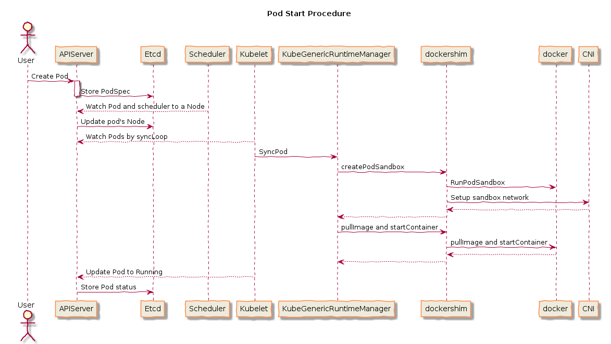

[TOC]

# 一、Pod

[官方文档](https://kubernetes.io/docs/concepts/workloads/pods/)

Pod是可以在主机上运行的容器的集合。此资源由客户端创建并计划在主机上。之后的 pod 控制器都是基于此。

```shell
# 可以查看 pods 资源的所有字段
kubectl explain pods
kubectl explain pods.spec.containers.lifecycle
```


## Pod 生命周期


整个生命状态：Pending、Running、Succeeded或Failed、Unknow

main container 启动之前有 init container 初始化容器进行初始化，main container 启动之后有 postSart hook 进行操作，期间有 startUpProbe、livenessProbe、readinessPrebe 探针对 pods进行检测，main container 结束之前有 preStop hook进行操作

### postStart

在初始化容器后的操作，主容器启动之前执行的命令。这个基本很少使用。

```shell
apiVersion: v1
kind: Pod
metadata:
  name: poststart-pod
  namespace: default
spec:
  containers:
  - name: busybox-httpd
    image: registry.cn-hangzhou.aliyuncs.com/xzqk8s/busybox:latest
    imagePullPolicy: IfNotPresent
    lifecycle:
      postStart:
        exec:
          #command: ["/bin/sh","-c","mkdir -p /data/web/html;echo 'Home Page' >> /data/web/html/index.html"]
          command: ['mkdir','-p','/data/web/html']
    command: ['/bin/sh','-c','sleep 3600']
```

### preStop

删除 pod 的时候在 terminationGracePeriodSeconds 默认 30秒内可以对 pod 的一些操作

## Pod 创建过程



## Container Probe
[官方文档](https://kubernetes.io/docs/concepts/workloads/pods/pod-lifecycle#container-probes)

### 1.startupProbe
[启动探针](https://kubernetes.io/docs/concepts/workloads/pods/pod-lifecycle/#when-should-you-use-a-startup-probe)
k8s 1.16 版本后新加的探测方式，用于判断容器内应用程序是否已经启动。如果配置了 startupProbe 就会先禁止其他的探测，直到它成功为止，成功后将不在进行探测。一般用于 Pod 启动比较慢的情况。如果失败会根据从起策略进行相应处理。

### 2.livenessProbe
[存活探针](https://kubernetes.io/docs/concepts/workloads/pods/pod-lifecycle/#when-should-you-use-a-liveness-probe)
用于探测容器是否运行，如果探测失败，kubelet 会根据配置的重启策略进行相应的处理。若没有配置该探针，默认就是success。

### 3.readinessProbe
[就绪探针](https://kubernetes.io/docs/concepts/workloads/pods/pod-lifecycle/#when-should-you-use-a-readiness-probe)
一般用于探测容器内的程序是否健康，它的返回值如果为 success，那么代表这个容器已经完成启动，并且程序已经是可以结束流量的状态。如果探测失败，容器会移除，也会从 endpoint 移除。


## restart Policy

重启策略包括：Always，OnFailure、Never。 默认值为Always。

restartPolicy适用于Pod中的所有容器。 restartPolicy仅指通过kubelet在同一节点上重新启动容器。 在Pod出口中的容器退出后，kubelet会以指数级的退避延迟（10s，20s，40s等）重新启动它们，上限为5分钟。 一旦容器执行了10分钟而没有任何问题，kubelet将重置该容器的重启退避计时器


## 探针检测方式

### 1.ExecAction
在容器内执行一个命令，如果返回值为0，则认为容器为健康

### 2.TCPSocketAction
通过 TCP 连接检查容器内的端口是否通的，如果是通的认为容器是健康（不可靠，可能端口起来了，可能不能访问）

### 3.HTTPGetAction
通过应用程序暴露的 API 地址来检查程序是否正常的，如果状态码为 200~400之间，则认为容器健康。（用的最多的）

探针的检测状态

- Success：容器通过了诊断。
- Failure：容器诊断失败。
- Unknown：诊断失败，因此不应采取任何措施。


## Pod的删除过程
[官方文档](https://kubernetes.io/docs/concepts/workloads/pods/pod-lifecycle/#pod-termination)

用户执行删除pod操作的过程：

- Pod变成Terminating
- 从Endpoint 删除该Pod的IP地址
- 执行PreStop的指令

当运行kubectl delete pod nginx 删除Pod时，群集会记录并跟踪允许的Pod被强制杀死之前的预定宽限期由terminationGracePeriodSeconds 这个参数设置，默认30秒。有了强有力的关机跟踪功能，kubelet 尝试正常关机。通常，容器运行时将TERM信号发送到每个容器中的主进程。许多容器运行时都遵循STOPSIGNAL容器映像中定义的值，并发送该值而不是TERM。宽限期到期后，将KILL信号发送到任何剩余的进程，然后从Pod中删除Pod。 API服务器。如果在等待进程终止时重新启动了kubelet或容器运行时的管理服务，则群集将从一开始重试，包括完整的原始宽限期。

Spring Cloud 更新的一些经验：
PreStop：先去请求 eureka 接口，把自己的IP地址和端口，进行下先，eureka从注册表中删除该应用的IP地址。然后容器进行sleep 90秒要大于注册的时间，但是如果大于terminationGracePeriodSeconds默认是30秒，是不会sleep 90秒，然后kill `pgrep java` 不能使用kill -9

## 一个比较完整 pod yaml

```shell
apiVersion: v1
kind: Pod
metadata:
  name: test-pod
  namespace: default
  labels:
    name: test-pod
    app: test-pod
  annotations:
    createby: "admin"
spec:
  containers:
  - name: test-pod
    image: ikubernetes/myapp:v1
    imagePullPolicy: IfNotPresent
    ports:
    - name: http
      containerPort: 80
    - name: https
      containerPort: 443
    startupProbe:
      httpGet:
        scheme: HTTP
        path: /
        port: 80
    livenessProbe:
      httpGet:
        scheme: HTTP
        path: /
        port: 80
      initialDelaySeconds: 30
      timeoutSeconds: 30
    readinessProbe:
      httpGet:
        scheme: HTTP
        path: /
        port: 80
      initialDelaySeconds: 30
      timeoutSeconds: 30
    env:
    - name: NGINX_SERVER_PORT
      valueFrom:
        configMapKeyRef:
          name: nginx-config
          key: nginx_port
          optional: true 
    - name: MYSQL_PASSWORD
      valueFrom:
        secretKeyRef:
          name: mysql-root-password
          key: password
          optional: true 
    resources:
      limits:
        cpu: "200m"
        memory: "256Mi"
      requests:
        cpu: "200m"
        memory: "256Mi"
    volumeMounts:
    - name: data
      mountPath: /usr/share/www/
      readOnly: true
  affinity:
    nodeAffinity:
      requiredDuringSchedulingIgnoredDuringExecution:
        nodeSelectorTerms:
        - matchFields:
          - key: metadata.name
            operator: In
            values:
            - szch-ztn-ops-mongodb03-test-192-168-83-40
  tolerations:
  - key: node-role.kubernetes.io/master
    value: NoSchedule
  restartPolicy: Always
  volumes:
  - name: data
    hostPath:
      path: /usr/share/www/
```

# 二、Pod 控制器


## 0.Replication Controller和ReplicaSet

​    Relication Controller（复制控制器，RC）和 ReplicaSet（复制集，RS）是两种简单部署 Pod 的方式。因为在生产环境中，主要使用更高级的 Deployment 等方式进行 Pod 的管理和部署，ReplicaSet是支持基于集合的标签选择的下一代 Replication Controller，和 Replication Controller 唯一的区别是 ReplicaSet 支持标签选择器。生产一般是用 deployment。

```shell
cat <<EOF | kubectl apply -f -
apiVersion: apps/v1
kind: ReplicaSet
metadata:
  name: myapp-rs
  namespace: xiaozhiqi
spec:
  replicas: 2
  selector:
    matchLabels:
      app: myapp
      release: canary
  template:
    metadata:
      name: myapp-pod  # 这里的name没有实际意义，以上面的 myapp-rs 其主要作用
      labels:  # 这里的labels必须和上面的matchLabels至少要一样，也可以多加
        app: myapp
        release: canary
    spec:
      containers:
      - name: myapp-container
        image: nginx
        imagePullPolicy: IfNotPresent
        ports:
        - name: http
          containerPort: 80
EOF
```


## 1.Label & Selector

Label: 对 k8s 中各种资源进行分类、分组，添加一个具有特别属性的一个标签。

Selector：通过一个过滤的语法进行查找到对应标签的资源，一般用于 Service 中用来对 Endpoint 的反带

```shell
# 对 node 进行打标签
kubectl label node docker-k8s01 region=zone7

# 对 node 进行过滤标签
kubectl get node -l region

# 对 node 进行修改标签
kubectl label node docker-k8s01 region=zone9 --overwrite

# 对 node 进行删除标签
kubectl label node docker-k8s01 region-

# 查看所有 Pod 的标签
kubectl get pod -A --show-labels

# 查看从列表中查看某个 标签
kubectl get po -A -l 'k8s-app in (metrics-server,kubernetes-dashboard)'

# 查看多个 label
kubectl get po -l version!=v1,app=nginx
kubectl get po -l version!=v1,'app in (busybox,nginx)'
```


## 2.Deployment

​    Deployment 是封装ReplicaSet之上，用于部署无状态的服务，最常用的控制器。一般用于管理维护企业内部无状态的微服务，比如 configserver、zuul、springboot。他可以管理多个副本的 Pod 实现无缝迁移、自动扩容缩容、自动灾难恢复、一键回滚等功能。在 pod 的基础上，depoyment 只是增加了几个主要参数：replicas、selector 和 template，deployment 是根据 pod 为基础生成template，此外可能需要设计到滚动更新策略 strategy

### deployment 创建

```shell
# 标准输入创建或者文件创建
cat << EOF | kubectl apply -f -
apiVersion: apps/v1
kind: Deployment
metadata:
  name: myapp-de
  namespace: default
spec:
  replicas: 2
  selector:
    matchLabels:
      app: nginx  # 这里的标签和下面的标签要一致，而且不能中途随意修改
      release: canary
  template:
    metadata:
      labels:
        app: nginx  # 这里的标签和下上面的标签要一致，而且不能中途随意修改
        release: canary
    spec:
      containers:
      - name: nginx
        image: nginx
        imagePullPolicy: IfNotPresent
        ports:
        - name: http
          containerPort: 80
EOF

# 命令行创建，kubectl create，kubectl run 是启动一个pod
kubectl create deployment nginx --image=nginx -n default
```

### deploy 查看

```shell
# 查看deployment的一些信息
kubectl get deploy nginx
kubectl get deploy nginx -o yaml
kubectl get deploy nginx -o wide
kubectl get deploy nginx --show-labels

# 因为deployment 是封装了 replicaset也能看到rs
kubectl get rs

# 可以直接修改生效，标签不能随意修改，如果是文件启动可以直接修改，然后重新 replace 也会生效
# 修改replicas参数不会重新生成 rs ，如果修改了 template 会重新生成 rs
kubectl edit deploy nginx
vim nginx-de.yaml
kubectl replace -f nginx-de.yaml

# 查看pod
kubectl get pods --show-labels

# 查看pod的详细信息
kubectl describe pods nginx-xxxxx
```

### deployment 更新资源

```shell
# 更新镜像，因为镜像是在 template 中所以会重新生成 rs，发版的时候用 set
kubectl set image deploy nginx nginx=nginx:1.15.3 --record

# 查看滚动更新记录
kubectl rollout status deploy nginx

# 查看历史滚动更新记录
kubectl rollout history deploy nginx
```

### deployment 回滚

```shell
# 模拟滚动更新异常
kubectl set image deploy nginx nginx=nginx:213412 --record

# 查看历史滚动更新记录
kubectl rollout history deploy nginx

# 回滚到上一个版本
kubectl rollout undo deploy nginx

# 模拟滚动更新异常
kubectl set image deploy nginx nginx=nginx:1234132 --record
kubectl set image deploy nginx nginx=nginx:1233345 --record

# 查看指定版本的详细信息，然后回滚到指定版本
kubectl rollout history deploy nginx --revision=5
kubectl rollout undo deploy nginx --to-revision=5
kubectl get deploy -o yaml
```

### deployment 扩容与缩容

```shell
# 扩容与缩容是不会产生新的 rs
kubectl scale --replicas=3 deploy nginx
```

### deployment暂停与恢复

```shell
# kubectl set 一次就会触发更新，如果更新多个资源，比如更新镜像、更新cpu、内存等。要么edit之后replace，要么使用暂停恢复功能
# 暂停 nginx 的更新
kubectl rollout pause deploy nginx

# 第一次更新
kubectl set image deploy nginx nginx=nginx:1.15.3 --record

# 第二次更新
kubectl set resources deploy nginx -c nginx --limits=cpu=200m,memory=128Mi --requests=cpu=10m,memory=16Mi

# 恢复 nginx 的更新
kubectl rollout resume deploy nginx

# 查看 deploy nginx 的更新操作
kubectl rollout status deploy nginx

# 验证 kubectl get pod nginx-xxxx-xxx -o yaml
```

### 更新注意事项

滚动更新记录限制：
- .spec.revisionHistoryLimit：设置保留RS旧的 revision 的个数，设置为0的话，不保留历史记录

滚动更新的策略：
- .spec.strategy.type：默认是 RollingUpdate
- .spec.strategy.rollingUpdate.maxSurge：可以超过期望值的最大pod数。默认是25%，值为数字（例如：5）或 百分比（例如：10％）。绝对值是通过四舍五入从百分比中得出的。如果MaxUnavailable为0，maxSurge则不能为0。 示例：当此设置为30％时，当replicas=6时在滚动更新开始时立即放大新RC到8个RS，以使旧容器和新容器的总数不超过所需容器的130％。一旦旧的RS被杀死，新的RS可以进一步扩大，确保在更新期间任何时间运行的RS总数几乎是所需RS的130％。

- .spec.strategy.rollingUpdate.maxUnavailable：更新期间不可用的最大pod数。默认是25%，值为数字（例如：5）或 百分比（例如：10％）。绝对值是通过四舍五入从百分比中得出的。如果MaxSurge为0，maxUnavailable则不能为0。示例：将其设置为30％时，当replicas=6在滚动更新开始时立即将旧的ReplicaSet缩小为所需容器的70％即（6*maxSurge-6*maxUnavailable）。 一旦准备好新的Pod，就可以进一步缩小旧的ReplicaSet，然后再扩展新的ReplicaSet，以确保更新期间始终可用的Pod总数至少为所需Pod的70％。


## 3.StatefulSet

### 基本概念

​    StatefulSet 简称（sts）主要用于管理有状态应用程序的工作负载 API 对象。比如在生产环境中，可以部署 ElasticSearch 集群、MongoDB集群或者需要持久化的 RabbitMQ 集群、Redis集群、Kafka集群和ZooKeeper集群等。

​    比如在进行 SpingCloud 项目容器化时，Eureka的部署是比较适合用 StatefulSet 部署方式的，可以给每个 Eureka 实例创建一个唯一固定的标识符，并且每个 Eureka实例无需配置多余的 Service，其余 Sping Boot 应用可以直接通过 Eureka 的 Headless Service 即可进行注册。

​    和 Deployment 类似，一个 StatefulSet 也同样管理着基于相同容器规范的 Pod。不同的是，StatefulSet 为每个 Pod 维护了一个粘性标识。这些 Pod 是根据相同的规范创建的。但是不可互换，每个 Pod 都有一个持久的标识符，在重新调度时也会保留，一般格式为 StatefulSetName-Number。比如定义一个名字是 Redis-Sentinel 的 StatefulSet ，指定创建三个 Pod，那么创建出来的 Pod 名字就为 Redis-Sentinel-0、Redis-Sentinel-1、Redis-Sentinel-2。而 StatefulSet 创建的 Pod 一般使用 Headless Service（无头服务）进行通信，和普通的 Service 的区别在于 Headless Service 没有 ClusterIP，它使用的是 Endpoint 进行互相通信。

Headless 一般的格式为：statefulSetName-{0..N-1}.serviceName.namespace.svc.cluster.local

- statefulSetName 为 StatefulSet的名字
- 0..N-1 为 Pod 所在的序号，从 0 开始到 N-1
- serviceName 为 Headless Service的名字，创建 StatefulSet 时，必须指定 Headless Service 名称；
- namespace 为服务所在的命名空间
- .cluster.local 为 Cluster Domain（集群域）

例如，要部署一个Redis主从，名为 redis-ms 的 StatefulSet ，第一个容器启动时，它的标识符为 redis-ms-01 并且 Pod 内主机名为 redis-ms-0，此时就可以根据主机名来判断，当主机名为 redis-ms-0 的容器作为 Redis 的主节点，其余从节点，那么 Slave 连接 Master 主机配置就可以使用不会更改的 Master 的 Headless Service，此时 Redis 从节点 Slave 配置文件就可以指定 slaveof redis-ms-0.redis-ms.public-service.svc.cluster.local 6379；其中 redis-ms-0.redis-ms.public-service.svc.cluster.local 如果同一命名空间下只需要写 redis-ms-0.redis-ms即可，后面的 public-service.svc.cluster.local 可以省略。

### 注意事项

一般 StatefulSet 用于有以下一个或者多个需求的应用程序：
- 需要稳定的独一无二的网络标识符，即 Pod 重新调度后 PodName 和 HostName 不变
- 需要持久化数据，即 Pod 重新调度后还是能访问到相同的持久化数据，基于 PVC
- 需要有序的、优雅的部署和扩展
- 需要有序的自动滚动更新

Pod 所用的存储必须由 PersistentVolume Provisioner（持久化卷配置器）根据请求配置 StorageClass，或者由管理员预先配置，当然也可以不配置存储。为了确保数据安全，删除和缩放 StatefulSet 不会删除与 StatefulSet 关联的卷，可以手动选择性删除 PVC 和 PV。StatefulSet 目前使用 Headless Service（无头服务）负责 Pod 的网络身份和通信，需要提前创建此服务。删除一个 StatefulSet 时，不保证对 Pod 的终止，要在 StatefulSet 中实现 Pod 的有序和正常终止，可以在删除之前将 StatefulSet 的副本缩减为0.

### StatefulSet 创建

```shell
cat << EOF | kubectl apply -f -
apiVersion: v1
kind: Service
metadata:
  name: nginx
  labels:
    app: nginx
spec:
  ports:
  - port: 80
    name: web
  clusterIP: None
  selector:
    app: nginx
---
apiVersion: apps/v1
kind: StatefulSet
metadata:
  name: web
spec:
  serviceName: "nginx"
  replicas: 2
  selector:
    matchLabels:
      app: nginx
  template:
    metadata:
      labels:
        app: nginx
    spec:
      containers:
      - name: nginx
        image: nginx
        ports:
        - containerPort: 80
          name: web
EOF
```
### statefulset 查看

```shell
kubectl get sts web -o wide
kubectl get sts web -o yaml
kubectl get pods --show-labels
```

### statefulset  扩容与缩减

```shell
# 扩容
kubectl scale --replicas=3 sts web

# 验证是能解析FQDN主机名
kubectl run busybox --image=busybox:1.28 -- sleep 3000
kubectl exec -it busybox -- nslookup web-0.nginx
kubectl exec -it busybox -- nslookup web-1.nginx
kubectl exec -it busybox -- ping web-1.nginx
kubectl exec -it busybox -- wget web-1.nginx
kubectl exec -it web-0 -- hostname

# 缩容
kubectl scale --replicas=2 sts web
```

### statefulset 更新策略
.spec.updateStrategy.type

- OnDelete：StatefulSet 控制器不会自动更新 StatefulSet 中的Pod。用户必须手动删除Pod，以使控制器创建新的Pod。

- RollingUpdate：实现了Pod的自动滚动更新，如果 .spec.updateStrategy 未指定，则此为默认策略。StatefulSet控制器将删除并重新创建 StatefulSet 中的每个Pod。它将以Pod终止（从最大序数到最小序数）的顺序进行，一次更新每个Pod。在更新下一个Pod之前，必须等待这个Pod Running and Ready。

.spec.updateStrategy.rollingUpdate.partition
- Partitions：通过指定 .spec.updateStrategy.rollingUpdate.partition 来对 RollingUpdate 更新策略进行分区，如果指定了分区，则当 StatefulSet 的 .spec.template 更新时，具有大于或等于分区序数的所有 Pod 将被更新。具有小于分区的序数的所有 Pod 将不会被更新，即使删除它们也将被重新创建。如果 StatefulSet 的 .spec.updateStrategy.rollingUpdate.partition 大于其 .spec.replicas，则其 .spec.template 的更新将不会传播到 Pod。在大多数情况下，不需要使用分区。比如 relicas=5 ，partition=3，那么会更新大于等于3的pod会更新

```shell
# kubectl set 或者 kubectl edit
kubectl set image sts web nginx=nginx:1.15.4 --record
kubectl get pods -w
kubectl rollout status sts web
```

### statefulset 灰度发布

```shell
# 扩容到5个副本
kubectl scale --replicas=5 sts web
kubectl patch sts web -p '{"spec":{"replicas":5}}'
kubectl patch sts web -p '{"spec":{"updateStrategy":{"rollingUpdate":{"partition":3}}}}'
kubectl set image sts web nginx=nginx:1.15.3 --record
kubectl get pods -w
```

### statefulset 级联删除和非级联删除

- 级联删除：删除 sts 的同时删除 Pod，默认模式
- 非级联删除：删除 sts 的同时不删除 Pod，删除 sts 后，Pod 变成了孤儿 Pod ，此时删除 Pod 不会被重建，基本不会用

```shell
kubectl delete sts web # 级联删除
kubectl delete sts web --cascade=false # 非级联删除
```


## 4.Daemonset

Daemonset 守护进程集，缩写为 ds，在所有节点或者匹配的节点上都部署一个 Pod。

- 运行集群存储的 daemon：ceph 或者 glusterd
- 节点的 CNI 网络插件：calico
- 节点日志的搜集：fluentd 或者 filebeat
- 节点的监控：node exporter
- 服务暴露：部署一个 ingress nginx

### daemonset 创建

```shell
cat << EOF | kubectl apply -f -
apiVersion: apps/v1
kind: DaemonSet
metadata:
  name: nginx-ds
  namespace: default
spec:
  selector:
    matchLabels:
      app: nginx
      release: canary
  template:
    metadata:
      labels:
        app: nginx
        release: canary
    spec:
      containers:
      - name: myapp
        image: nginx
        imagePullPolicy: IfNotPresent
        ports:
        - name: http
          containerPort: 80
EOF
```

### daemonset 查看

```shell
kubectl get ds nginx-ds -o wide
kubectl get ds nginx-ds -o yaml
kubectl get pods -o yaml

# 给 node 节点打上 labels
kubectl label node szch-ztn-ops-mongodb03-test-192-168-83-40 szch-ztn-ops-mongodb02-test-192-168-83-39 ds=true

# 删除 labels
kubectl label node szch-ztn-ops-mongodb03-test-192-168-83-40 szch-ztn-ops-mongodb02-test-192-168-83-39 ds-

# 打补丁更改加上 nodeSelector 节点选择器
kubectl patch ds nginx-ds -p '{"spec": {"template": {"spec": {"nodeSelector": {"ds":"true"}}}}}'

# 查看节点，只有节点有 ds=true的标签才会启动容器
kubectl get pod
```

### daemonset 更新和回滚

spec.updateStrategy.rollingUpdate.maxUnavailable 设置为 1，而且如果是使用 daemonset 的话最好使用 OnDelete，更新的时候影响比较小

```shell
kubectl patch ds nginx-ds -p '{"spec": {"updateStrategy": {"type": "OnDelete"}}}'
kubectl set image ds nginx-ds nginx=nginx:1.15.4 --record
kubectl delete pod nginx-ds-xxx
kubectl get pod -o yaml | grep image
kubectl get pods -w
kubectl rollout history ds nginx-ds
```


## 5.HPA

Horizontail Pod Autoscaler：Pod 的水平自动伸缩器。观察 Pod 的 CPU、内存使用率自动扩展或缩容 Pod 的数量。不适用于无法缩放的对象，比如 DaemonSet。应对突发流量。像java不用内存当作指标自动扩容。当部署了 deployment之后，就由 HPA 接管，定义最小数量pod 和 最大数量 pod

CPU、内存或者自定义扩容指标。必须定义 Requests 参数，HPA是基于metrics-server，metrics-server 要安装好。

--cpu-percent 超过CPU百分之多少进行扩容

--min=1 CPU降低下来最低多少pod

--max=3 CPU扩容最多多少pod

```shell
cat << EOF | kubectl apply -f -
apiVersion: apps/v1
kind: Deployment
metadata:
  name: nginx-de
  namespace: default
spec:
  replicas: 3
  selector:
    matchLabels:
      app: nginx
      release: canary
  template:
    metadata:
      labels:
        app: nginx
        release: canary
    spec:
      containers:
      - name: nginx
        image: nginx
        imagePullPolicy: IfNotPresent
        ports:
        - name: http
          containerPort: 80
        resources:
          limits:
            cpu: 100m
            memory: 10Mi
          requests:
            cpu: 3m
            memory: 3Mi
EOF

# 自动扩展
kubectl autoscale deploy nginx-de --cpu-percent=20 --min=1 --max=3
kubectl get hpa -w

# 获取podIP，进行对pod进行压测，后续的可以部署service，获取service IP进行压测
kubectl get pod -o wide

# 进行压测
ab -n100000 -c100 http://10.100.149.173/
while true;do wget -q -O- http://10.100.149.173 >/dev/null;done

# 查看日志请求
kubectl log -f -l app=nginx
```


## 6.Job

基本不适用，使用 CrontJob

## 7.CronJob

[REFERENCE](https://kubernetes.io/zh/docs/concepts/workloads/controllers/cron-jobs/)

在 k8s 里面运行周期性的计划任务，crontab。cronjob 名称不能超过 52 个字符。 这是因为 CronJob 控制器将自动在提供的 Job 名称后附加 11 个字符，并且存在一个限制， 即 Job 名称的最大长度不能超过 63 个字符。Cron Job 创建基于时间调度的 Jobs。一个 CronJob 对象就像 crontab (cron table) 文件中的一行。 它用 Cron 格式进行编写， 并周期性地在给定的调度时间执行 Job。

- \* \* \* \* \* 分时日月周
- 你的计划任务可能需要调用应用的接口
- 你的计划任务可能需要依赖某些环境
- php xxxx，直接用 php 项目的镜像进行执行计划任务
- php-wordpress:v1.0.1
- CronJob 被调用的时间，是用的 controller-manager 的时间。跑容器需要调整时间


```shell
# 这种已经过时
kubectl run hello --scheduler="*/1 * * * *" --restart=OnFailure --image=nginx --image-pull-policy=IfNotPresent -- /bin/sh -c "date"


cat > cronjob/cronjob.yaml <<EOF
apiVersion: batch/v1beta1
kind: CronJob
metadata:
  name: hello
spec:
  schedule: "*/1 * * * *"
  jobTemplate:
    spec:
      template:
        spec:
          containers:
          - name: hello
            image: busybox
            imagePullPolicy: IfNotPresent
            command:
            - /bin/sh
            - -c
            - date; echo Hello from the Kubernetes cluster
          restartPolicy: OnFailure
EOF

kubectl apply -f cronjob/cronjob.yaml

kubectl get cj
kubectl get cj hello -o yaml

kubectl logs -f hello
```

.spec.concurrencyPolicy #  并发调度策略
- Allow  Allow运行同时运行多个任务
- Forbid 不运行并发执行
- Replace 替换之前的任务

.spec.failedJobsHistoryLimit  # 保留失败的任务数
.spec.schedule: '*/1 * * * *'  # 调度策略
.spec.successfulJobsHistoryLimit: 3  # 成功的 Job 保留的次数
.spec.suspend：false # 挂起，true: cronjob不会被执行
.spec.startingDeadlineSeconds # 如果 startingDeadlineSeconds 设置为很大的数值或未设置（默认），并且 concurrencyPolicy 设置为 Allow，则作业将始终至少运行一次。如果 startingDeadlineSeconds 的设置值低于 10 秒钟，CronJob 可能无法被调度。 这是因为 CronJob 控制器每 10 秒钟执行一次检查。


