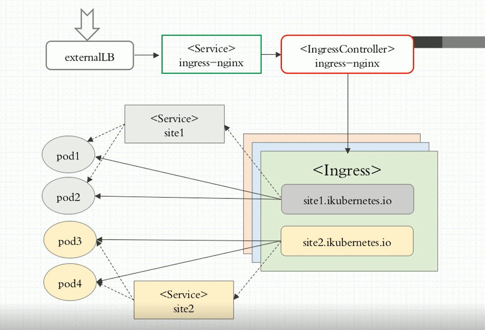

[TOC]

# Service

Service 可以简单的理解为逻辑上的一组 Pod。一种可以访问 Pod 的策略，而且其他 Pod 可以通过这个 Service 访问到这个 Service代理的 Pod。相对于 Pod 而言，它会有一个固定的名称，一旦创建就固定不变，像阿里云的内网的 SLB。创建的 Service 的同时会创建一个同名的 Endpoint 记录了映射的 Pod 的 IP 地址。Service 通过 selector 绑定 Label 来指定 Pod 具有相同的 Label，就可以建立关系。

.spec.type 有以下几种类型：ClusterIP、NodePort、ExternalName（用于外部的服务）、LoadBalancer（用于公有云SLB）

.spec.ports 有以下几种端口：port（service 暴露的端口）、targetport（Pod暴露的端口）、nodeport（节点暴露的端口）

.spec.ports.protocol 支持以下协议：TCP、UDP、SCTP 默认是 TCP


## 1.使用场景

- 反代集群内的 Deployment Pod 无状态
- 反代集群内的 StatefulSet Pod 有状态
- 希望生产环境中使用某个固定的名称而非 IP 地址进行访问外部的中间件服务
- 希望 Service 指向另一个 Namespace 中或其他集群中的服务
- 某个项目正在迁移至 k8s 集群，但是一部分服务仍然在集群外部，此时可以使用 service 代理至 k8s 集群外部的服务
- 开发临时需要访问 redis , rebbitmq 之类的查些数据，暴露 nodeport 端口给开发查询


## 2.ClusterIP

在集群内部使用，不指定 clusterIP 会自动分配IP，生产也建议不指定 IP，自己制定IP的话有可能有 IP 冲突的情况，内部直接调用 servicename。

### (1).反代k8s集群内Pod

如果同一个命名空间使用 service name 或者 service IP（一般不建议使用IP） 即可，如果不是同一个命名空间 使用  servicename.namespace.svc.cluster.local 比如 nginx-headless.default.svc.cluster.local.

```shell
# 创建 deployment
cat > nginx-de.yaml << EOF
apiVersion: apps/v1
kind: Deployment
metadata:
  name: nginx
  namespace: default
spec:
  replicas: 3
  selector:
    matchLabels:
      app: nginx
      release: canary
  template:
    metadata:
      labels:
        app: nginx
        release: canary
    spec:
      containers:
      - name: nginx
        image: nginx
        imagePullPolicy: IfNotPresent
        ports:
        - name: http
          containerPort: 80
EOF

kubectl apply -f nginx-de.yaml

# 创建 service
cat > nginx-svc.yaml << EOF
apiVersion: v1
kind: Service
metadata:
  name: nginx-svc
  namespace: default
  labels:
    app: nginx-svc
spec:
  type: ClusterIP
  selector:
    app: nginx
    release: canary
  ports:
  - name: http
    port: 80
    protocol: TCP
    targetPort: 80
  - name: https
    port: 443
    protocol: TCP
    targetPort: 443
EOF

kubectl apply -f nginx-svc.yaml

# 查看
kubectl get svc nginx-svc -o yaml

# 创建 service 的同时也会 创建一个同名的 Endpoint
kubectl get svc,ep nginx-svc
NAME                TYPE        CLUSTER-IP     EXTERNAL-IP   PORT(S)          AGE
service/nginx-svc   ClusterIP   10.96.189.34   <none>        80/TCP,443/TCP   77s

NAME                  ENDPOINTS                                                            AGE
endpoints/nginx-svc   10.100.145.19:443,10.100.149.158:443,10.100.20.148:443 + 3 more...   77s

# 验证
kubectl run busybox --image=busybox:1.28 -- sleep 3000

# 解析 service 的主机名 nginx-svc
kubectl exec -it busybox -- nslookup nginx-svc

# 访问这个 service
kubectl exec -it busybox -- wget nginx-svc

# 如果不在同一个命名空间，比如访问公共的命名空间的时候会这样使用
kubectl exec -it busybox -- wget http://nginx-svc.default
```

### (2).反代k8s外部服务

指定 type 类型为 ClusterIP，但不指定 selector。创建 Service 的时候，不会创建同名的 Endpoint，需要自己创建 Endpoint，来绑定要指定的服务。创建的时候 ExrernalName Service 和 ExternalName Endpoint name和protocol需要一致，不然建立不了连接。这样 Service 就可以指向另一个 Namespace 中或其他集群中的服务

```shell
# 创建 ExternalName 类型的 service
cat > nginx-svc-external.yaml << EOF
apiVersion: v1
kind: Service
metadata:
  name: nginx-svc-external
  labels:
    app: nginx-svc-external
spec:
  type: ClusterIP
  ports:
  - name: http
    port: 80
    protocol: TCP
    targetPort: 80
EOF

kubectl apply -f nginx-svc-external.yaml

# 查看创建 ExternalName 类型的 service 不会同时创建同名的 Endpoint，需要自己创建
kubectl get svc,ep nginx-svc-external

# 创建 Endpoint
cat > nginx-ep-external.yaml <<EOF
apiVersion: v1
kind: Endpoints
metadata:
  name: nginx-svc-external
  namespace: default
  labels:
    app: nginx-svc-external
subsets:
- addresses:
  - ip: 8.135.28.20 # ztn的IP
  ports:
  - name: http
    port: 80
    protocol: TCP
EOF

kubectl apply -f nginx-ep-external.yaml

# 
kubectl get svc,ep nginx-svc-external

# 验证访问baidu.com和访问 external service ip是否一致，如果 dns 有解析的话，也可以通过 external service 的名字也可以访问，集群内部是可以访问的，比如启动一个 kubectl exec -it busybox -- nslookup nginx-svc-external 是可以解析的
curl -I baidu.com
curl -I 10.96.38.183
curl -I nginx-svc-external

# 如果外部的IP变了，只需要编辑下即可，或者临时打个补丁，或者直接编辑 Yaml 然后 replace -f
kubectl edit ep nginx-svc-external
kubectl patch ep nginx-svc-external -p '{"subsets": [{"addresses": [{"ip": "140.205.94.189"}]}]}'
vim nginx-svc-external.yaml
kubectl replace -f nginx-svc-external.yaml
```

### (3).headless service
Headless Service（无头服务）只要 clusterIP设置为 None 即为 Headless Service（无头服务）用于 StatefulSet 控制器，用于有状态服务反代 Statefulset Pod。如果同一个命名空间使用 service name 即可，如果不是同一个命名空间 使用  servicename.namespace.svc.cluster.local 比如 nginx-headless.default.svc.cluster.local.

```shell
cat > nginx-svc-headerless.yaml <<EOF
apiVersion: v1
kind: Service
metadata:
  name: nginx-headless
  namespace: default
spec:
  selector:
    app: nginx
    release: canary
  clusterIP: None
  ports:
  - port: 80
    targetPort: 80
EOF

kubectl apply -f nginx-svc-headerless.yaml
kubectl get svc,ep    
    
# headerless service 是直接解析到后端 Pod，而正常 service 是解析到 clusterIP   
dig -t A nginx-headless.default.svc.cluster.local. @kubernetes-dns
kubectl get pods -o wide

```


## 3.ExternalName

ExternalName 只指定 type 为 ExternalName 其他不指定，端口默认都是80。这种类型也不创建同名的 Endpoint

### (1).反代外部域名（用的比较少）

```shell
# 创建 ExternalName 类型的 service
cat > nginx-externalName.yaml << EOF
apiVersion: v1
kind: Service
metadata:
  name: nginx-externalname
  labels:
    app: nginx-externalname
spec:
  type: ExternalName
  externalName: www.baidu.com
EOF

kubectl apply -f nginx-externalName.yaml

# 查看也不会生成同名的 Endpoint
kubectl get svc,ep

# 验证
kubectl run busybox --image=busybox:1.28 -- sleep 100
kubectl exec -it busybox -- nslookup nginx-externalname # 可以解析这个 service name
kubectl exec -it busybox -- wget 14.215.177.39 # 也可以请求baidu的IP
kubectl exec -it busybox -- wget http://nginx-externalname # 存在跨域问题所以是403
```


## 4.NodePort

在所有安装了 kube-proxy的节点打开一个端口，此端口代理至后端 Pod，然后集群外部可以使用节点的 IP地址和 NodePort 的端口访问到集群 Pod 的服务。NodePort 端口范围是 kube-apiserver 配置文件中定义的 端口范围。3000-32767，使用场景用于，开发临时需要访问 redis、rabbimq 之类的，临时开启端口进行查些数据。

```shell
cat > nginx-svc-nodeport.yaml << EOF
apiVersion: v1
kind: Service
metadata:
  name: nginx-nodeport
  namespace: default
spec:
  selector:
    app: nginx
    release: canary
  type: NodePort
  ports:
  - port: 80
    targetPort: 80
    nodePort: 30080  # 也可以不指定，会自动分配
EOF

kubectl apply -f nginx-svc-nodeport.yaml

# 查看
kubectl get svc,ep nginx-nodeport
```


# Ingress

通俗来讲，Ingress和之前提到的 Service、Deployment，也是一个 k8s 的资源类型，Ingress 用于实现域名的方式访问 k8s 内部应用。nginx、haproxy、traefik、lstio 都可以实现对 Service 的发布。



## Ingress-nginx 安装

[REFERENCE](https://kubernetes.github.io/ingress-nginx/deploy/#using-helm)

### 1. helm 客户端安装

[REFERENCE](https://helm.sh/zh/docs/intro/install/)

```shell
# 安装 helm 客户端
wget -o /root/packages/helm-v3.5.3-linux-amd64.tar.gz https://get.helm.sh/helm-v3.5.3-linux-amd64.tar.gz
tar xf /root/packages/helm-v3.5.3-linux-amd64.tar.gz -C /root/packages/
mv /root/packages/linux-amd64/helm /usr/local/bin/helm
helm version
```

### 2. helm 下载 ingress-nginx
```shell
# 增加 ingress-nginx 仓库
helm repo add ingress-nginx https://kubernetes.github.io/ingress-nginx
helm repo list
helm search repo ingress-nginx

# 下载 ingress-nginx 的包
cd manifests && helm pull ingress-nginx/ingress-nginx
tar xf ingress-nginx-3.25.0.tgz
```
### 3. 修改 ingress-nginx 默认值
```shell
# 修改 ingress-nginx 一些默认值
cd ingress-nginx && vim values.yaml
repository: registry.cn-beijing.aliyuncs.com/dotbalo/controller  # 如果可以翻墙就不用更改镜像
# digest: sha256:3dd0fac48073beaca2d67a78c746c7593f9c575168a17139a9955a82c63c4b9a
dnsPolicy: ClusterFirstWithHostNet  # 如果是hostNetwork dns 需要设置 ClusterFirstWithHostNet 不然没法解析service
hostNetwork: true
kind: DaemonSet  # 使用daemonset
nodeSelector:
  kubernetes.io/os: linux
  ingress: "true" # 添加标签
resources:
#  limits:  # 如果生产环境需要设置资源限制
#    cpu: 100m
#    memory: 90Mi
  requests:
    cpu: 100m
    memory: 90Mi
type: ClusterIP # 使用 ClusterIP
repository: registry.cn-beijing.aliyuncs.com/dotbalo/kube-webhook-certgen
```
### 4. 安装 ingress-nginx
```shell
# 创建 ingress-nginx 命名空间
kubectl create ns ingress-nginx

# 打上 ingress=true 标签
kubectl label node szch-ztn-ops-mongodb03-test-192-168-83-40 ingress=true

# 安装
helm install ingress-nginx -n ingress-nginx .

# 查看
kubectl get po -n ingress-nginx -o wide

# 在 ingress=true的节点可以查看，在本地监听了80端口
netstat -tnlp | grep nginx
ps aux | grep ingress-nginx

# 扩容，然后在网关添加该IP
kubectl label node szch-ztn-ops-mongodb01-test-192-168-83-38 ingress=true

# 缩容，注意生产环境，需要在网关先摘掉该IP
kubectl label node szch-ztn-ops-mongodb03-test-192-168-83-40 ingress-
```
### 5. 扩容缩容 ingress-index
```shell
# 扩容，然后在网关添加该IP
kubectl label node szch-ztn-ops-mongodb01-test-192-168-83-38 ingress=true

# 缩容，注意生产环境，需要在网关先摘掉该IP
kubectl label node szch-ztn-ops-mongodb03-test-192-168-83-40 ingress-
```

### 6. 简单使用

[REFERENCE](https://kubernetes.github.io/ingress-nginx/user-guide/nginx-configuration/)

```shell
# 配置 deploy service
cat > nginx-de-svc.yaml <<EOF
apiVersion: v1
kind: Service
metadata:
  name: nginx-svc
  namespace: default
spec:
  type: ClusterIP
  selector:
    app: nginx
    release: canary
  ports:
  - name: http
    port: 80
    protocol: TCP
    targetPort: 80
---
apiVersion: apps/v1
kind: Deployment
metadata:
  name: nginx
  namespace: default
spec:
  replicas: 3
  selector:
    matchLabels:
      app: nginx
      release: canary
  template:
    metadata:
      labels:
        app: nginx
        release: canary
    spec:
      containers:
      - name: nginx
        image: nginx
        imagePullPolicy: IfNotPresent
        ports:
        - name: http
          containerPort: 80
EOF

kubectl apply -f nginx-de-svc.yaml

# 配置 ingress
cat > nginx-ingress.yaml <<EOF
apiVersion: networking.k8s.io/v1beta1 # 新版networking.k8s.io/v1和v1beta1有点不一样
kind: Ingress
metadata:
  annotations:
    kubernetes.io/ingress.class: "nginx" # 这个在 ingress-nginx 包的 values.yaml ingressClass定义
  name: example
  namespace: default
spec:
  rules: # 一个 ingress 可以配置多个 rules
  - host: foo.bar.com  # 域名配置，可以不写，匹配*，或者*.bar.com
    http:
      paths:  # 相当于 nginx 的 location 配合，同一个 host 可以配置多 path
      - backend:
          serviceName: nginx-svc
          servicePort: 80
        path: /
EOF

kubectl apply -f nginx-ingress.yaml

# 查看
kubectl get ingress

# 绑定 host 直接访问域名，请求 foo.bar.com 即可。生产是域名做DNS解析到nginx网关，然后网关到ingress

# 进入容器查看
kubectl exec -it ingress-nginx-controller-xxl86 -n ingress-nginx -- sh
grep '## start server foo.bar.com' nginx.conf -A 20
```

### 7. 多域名使用

```shell
# 使用 service external
cat > nginx-svc-ep-external.yaml <<EOF
apiVersion: v1
kind: Service
metadata:
  name: nginx-svc-external
  labels:
    app: nginx-svc-external
spec:
  #type: ExternalName
  ports:
  - name: http
    port: 80
    protocol: TCP
    targetPort: 80
---
apiVersion: v1
kind: Endpoints
metadata:
  name: nginx-svc-external
  namespace: default
  labels:
    app: nginx-svc-external
subsets:
- addresses:
  - ip: 8.135.28.20
  ports:
  - name: http
    port: 80
    protocol: TCP
EOF

kubectl apply -f nginx-svc-ep-external.yaml


# 使用多域名
vim nginx-ingress.yaml 

apiVersion: networking.k8s.io/v1beta1
kind: Ingress
metadata:
  annotations:
    kubernetes.io/ingress.class: "nginx"
  name: example
  namespace: default
spec:
  rules: # 一个 ingress 可以配置多个 rules
  - host: foo.bar.com  # 域名配置，可以不写，匹配*，或者*.bar.com
    http:
      paths:  # 相当于 nginx 的 location 配合，同一个 host 可以配置多 path
      - backend:
          serviceName: nginx-svc
          servicePort: 80
        path: /
  - host: foo2.bar.com  # 域名配置，可以不写，匹配*，或者*.bar.com
    http:
      paths:  # 相当于 nginx 的 location 配合，同一个 host 可以配置多 path
      - backend:
          serviceName: nginx-svc-external
          servicePort: 80
        path: /

kubectl replace -f nginx-ingress.yaml

kubectl get ingress

# 绑定hosts访问 foo2.bar.com
# 生产环境需要注意，有rewrite，写一个yaml，同一类的写一个yaml

```


### TCP 4层代理


### 复杂使用

[REFERENCE](https://kubernetes.github.io/ingress-nginx/user-guide/nginx-configuration/annotations/#rewrite)


