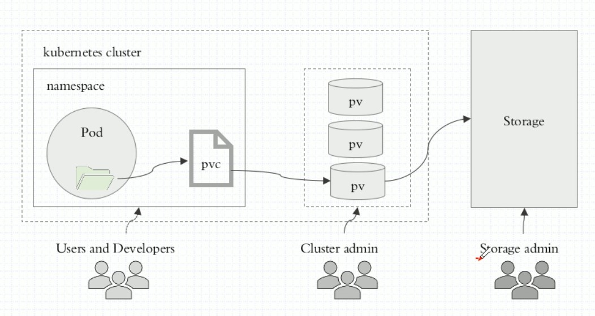
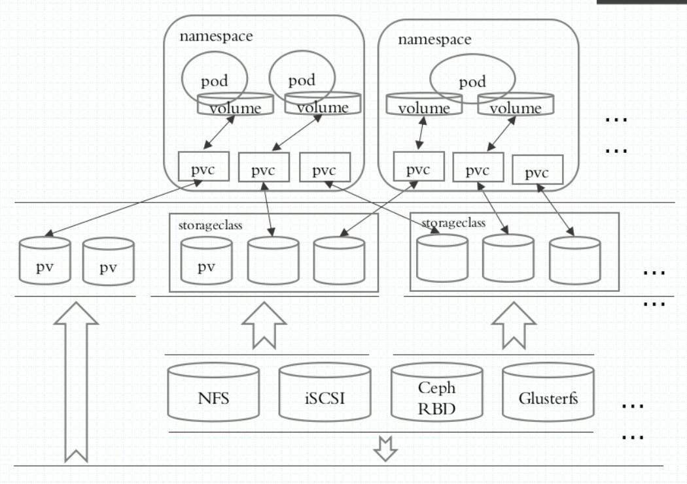

[TOC]

# Volumes

[REFERENCE](https://kubernetes.io/zh/docs/concepts/storage/volumes/)

`kubectl explain pods.spec.volumes`

Container（容器）中的磁盘文件是短暂的，当容器奔溃时，kubelet 会重新启动容器，但最初的文件将丢失，Container 会以最干净的状态启动。另外，当一个 Pod 运行多个 Container 时，各个容器可能需要共享一些文件。Volumes 可以这两个问题。

一些需要持久化数据的数据才会用到 Volumes，或者一些需要共享数据的容器需要 Volumes。

- Redis-Cluster: nodes.conf

- 日志搜集的需求：需要在应用程序的容器里面加一个 sidecar，这个容器是一个搜集日志的容器，比如：filebeaet，它通过 Volumes 共享应用程序的日志文件目录。

## Volumes 支持的类型

### emptyDir

`kubectl explain pods.spec.volumes.emptyDir`

当 Pod 分派到某个 Node 上时，`emptyDir` 卷会被创建，并且在 Pod 在该节点上运行期间，卷一直存在。 卷最初是空的。 尽管 Pod 中的容器挂载 `emptyDir` 卷的路径可能相同也可能不同，这些容器都可以读写 `emptyDir` 卷中相同的文件。 当 Pod 因为某些原因被从节点上删除时，`emptyDir` 卷中的数据也会被永久删除。**说明：** 容器崩溃并**不**会导致 Pod 被从节点上移除，因此容器崩溃期间 `emptyDir` 卷中的数据是安全的。

`emptyDir` 的一些用途：

- 缓存空间，例如基于磁盘的归并排序。
- 为耗时较长的计算任务提供检查点，以便任务能方便地从崩溃前状态恢复执行。
- 在 Web 服务器容器服务数据时，保存内容管理器容器获取的文件。

```shell
apiVersion: v1
kind: Pod
metadata:
  name: test-pd
spec:
  containers:
  - image: k8s.gcr.io/test-webserver
    name: test-container
    volumeMounts:
    - mountPath: /cache
      name: cache-volume
  volumes:
  - name: cache-volume
    emptyDir: {}
      #medium: Meory
```

### hostPath

`kubectl explain pods.spec.volumes.hostPath`

`hostPath` 卷能将主机节点文件系统上的文件或目录挂载到你的 Pod 中。 不然常用

`hostPath` 的一些用法有：

- 运行一个需要访问 Docker 内部机制的容器；可使用 `hostPath` 挂载 `/var/lib/docker` 路径。
- 在容器中运行 cAdvisor 时，以 `hostPath` 方式挂载 `/sys`。
- 允许 Pod 指定给定的 `hostPath` 在运行 Pod 之前是否应该存在，是否应该创建以及应该以什么方式存在。

除了必需的 `path` 属性之外，用户可以选择性地为 `hostPath` 卷指定 `type`。


| **type 取值**     | **注解**                                                     |
| ----------------- | ------------------------------------------------------------ |
|                   | 空字符串（默认）用于向后兼容，这意味着在安装 hostPath 卷之前不会执行任何检查。 |
| DirectoryOrCreate | 如果在给定路径上什么都不存在，那么将根据需要创建空目录，权限设置为 0755，具有与 kubelet 相同的组和属主信息。 |
| Directory         | 在给定路径上必须存在的目录。                                 |
| FileOrCreate      | 如果在给定路径上什么都不存在，那么将在那里根据需要创建空文件，权限设置为 0644，具有与 kubelet 相同的组和所有权。 |
| File              | 在给定路径上必须存在的文件。                                 |
| Socket            | 在给定路径上必须存在的 UNIX 套接字。                         |
| CharDevice        | 在给定路径上必须存在的字符设备。                             |
| BlockDevice       | 在给定路径上必须存在的块设备。                               |

注意：具有相同配置（例如基于同一 PodTemplate 创建）的多个 Pod 会由于节点上文件的不同 而在不同节点上有不同的行为。

```shell
# 挂载宿主机上的 timezone 进而修改 容器内的timezone
cat > /etc/timezone << EOF
Asia/Shanghai
EOF

cat <<EOF | kubectl apply -f -
apiVersion: v1
kind: Pod
metadata:
  name: nginx-hostpath
spec:
  containers:
  - image: nginx
    name: nginx-hostpath
    volumeMounts:
    - mountPath: /etc/timezone
      name: timezone
  volumes:
  - name: timezone
    hostPath:
      # 宿主上目录位置
      path: /etc/timezone
      # 此字段为可选
      type: File
EOF
```

这里只演示 hostPath 挂载，至于 时区的问题，后续使用 podPreset 资源来使用

### configMap

`kubectl explain pods.spec.volumes.configMap`

在使用 ConfigMap之前你首先要创建它。容器以 [subPath](https://kubernetes.io/zh/docs/concepts/storage/volumes/#using-subpath) 卷挂载方式使用 ConfigMap 时，将无法接收 ConfigMap 的更新。文本数据挂载成文件时采用 UTF-8 字符编码。如果使用其他字符编码形式，可使用 `binaryData` 字段。

```shell
apiVersion: v1
kind: Pod
metadata:
  name: configmap-pod
spec:
  containers:
    - name: test
      image: busybox
      volumeMounts:
        - name: config-vol
          mountPath: /etc/config
  volumes:
    - name: config-vol
      configMap:
        name: log-config
        items:
          - key: log_level
            path: log_level
```

`log-config` ConfigMap 以卷的形式挂载，并且存储在 `log_level` 条目中的所有内容 都被挂载到 Pod 的 `/etc/config/log_level` 路径下。 请注意，这个路径来源于卷的 `mountPath` 和 `log_level` 键对应的 `path`。

### secret

`kubectl explain pods.spec.volumes.secret`

`secret` 卷用来给 Pod 传递敏感信息，例如密码。你可以将 Secret 存储在 Kubernetes API 服务器上，然后以文件的形式挂在到 Pod 中，无需直接与 Kubernetes 耦合。 `secret` 卷由 tmpfs（基于 RAM 的文件系统）提供存储，因此它们永远不会被写入非易失性 （持久化的）存储器。使用前你必须在 Kubernetes API 中创建 secret。容器以 subPath 卷挂载方式挂载 Secret 时，将感知不到 Secret 的更新。

```shell
# 创建 secret
kubectl create secret generic test-secret --from-literal='username=my-app' --from-literal='password=39528$vdg7Jb'

# 创建 Pod 挂载 Secret
cat > pods/secret-pod.yaml <<EOF
apiVersion: v1
kind: Pod
metadata:
  name: secret-test-pod
spec:
  containers:
    - name: test-container
      image: nginx
      volumeMounts:
        # name 必须和下面的 volumes 的 name 是一样的
        - name: secret-volume
          mountPath: /etc/secret-volume
  # The secret data is exposed to Containers in the Pod through a Volume.
  volumes:
    - name: secret-volume
      secret:
        secretName: test-secret
EOF

kubectl create -f secret-pod.yaml
```

### nfs

`kubectl explain pods.spec.volumes.nfs`

生产环境很少使用，没有高可用解决方案，阿里云的话可以挂在nas，公司有nas的话也可以。即使要使用也是使用 PV ,PVC 这种

部署 **NFS SERVER**

```shell
yum install nfs-utils -y
mkdir /data/volumes -p
cat /etc/exports
/data/volumes 192.168.1.0/24(rw,no_root_squash)

systemctl enable nfs && systemctl start nfs

showmount -e 192.168.1.20

# 创建个文件使得挂载能看到主页
cat /data/volumes/index.html
<h1> nfs stor1</h1>

# 修改export之后不需要重启Nfs
$ exportfs -r
```

**k8s节点安装NFS客户端**

```shell
# 所有worker节点，如果 master 也需要当 worker 节点使用也需要安装
yum -y install nfs-utils
mount -t nfs 192.168.1.20:/data/volumes /mnt
```

**Pod 挂在 NFS**

```shell
cat > pod-vol-nfs.yaml <<EOF
apiVersion: v1
kind: Pod
metadata:
  name: pod-vol-host
  namespace: default
spec:
  containers:
  - name: myapp-host
    image: ikubernetes/myapp:v1
    imagePullPolicy: IfNotPresent
    ports:
    - name: http
      containerPort: 80
    - name: https
      containerPort: 443
    volumeMounts:
    - name: html
      mountPath: /usr/share/nginx/html/
  volumes:
  - name: html
    nfs:
      path: /data/volumes
      server: 192.168.1.20
EOF

kubectl apply -f pod-vol-nfs.yaml
kubectl get pods -o wide
NAME           READY     STATUS    RESTARTS   AGE       IP           NODE            NOMINATED NODE
pod-vol-host   1/1       Running   0          2m        172.20.6.2   docker-k8s-03   <none>

curl 172.20.6.2
<h1> nfs stor1</h1>
```

### cephfs

[REFERENCE](https://kubernetes.io/zh/docs/concepts/storage/volumes/#cephfs)

一般使用PV,PVC管理

### rbd

[REFERENCE](https://kubernetes.io/zh/docs/concepts/storage/volumes/#rbd)

一般使用PV,PVC管理

### glusterfs

[REFERENCE](https://kubernetes.io/zh/docs/concepts/storage/volumes/#glusterfs)

一般使用PV,PVC管理

### persisntenVolumeClaim

[REFERENCE](https://kubernetes.io/zh/docs/concepts/storage/volumes/#persistentvolumeclaim)

`persistentVolumeClaim` 卷用来将[持久卷](https://kubernetes.io/zh/docs/concepts/storage/persistent-volumes/)（PersistentVolume） 挂载到 Pod 中。 持久卷申领（PersistentVolumeClaim）是用户在不知道特定云环境细节的情况下"申领"持久存储 （例如 GCE PersistentDisk 或者 iSCSI 卷）的一种方法。一般使用PV管理

# PersistenVolume

[REFERENCE](https://kubernetes.io/zh/docs/concepts/storage/persistent-volumes/)

`kubectl explain pv|pvc`

存储的管理是一个与计算实例的管理完全不同的问题。PersistentVolume 子系统为用户 和管理员提供了一组 API，将存储如何供应的细节从其如何被使用中抽象出来。 为了实现这点，我们引入了两个新的 API 资源：PersistentVolume 和 PersistentVolumeClaim。

持久卷（PersistentVolume，PV）是集群中的一块存储，可以由管理员事先供应，或者 使用[存储类（Storage Class）](https://kubernetes.io/zh/docs/concepts/storage/storage-classes/)来动态供应。 持久卷是集群资源，就像节点也是集群资源一样。PV 持久卷和普通的 Volume 一样，也是使用 卷插件来实现的，只是它们拥有独立于任何使用 PV 的 Pod 的生命周期。 此 API 对象中记述了存储的实现细节，无论其背后是 NFS、iSCSI 还是特定于云平台的存储系统。

持久卷申领（PersistentVolumeClaim，PVC）表达的是用户对存储的请求。概念上与 Pod 类似。 Pod 会耗用节点资源，而 PVC 申领会耗用 PV 资源。Pod 可以请求特定数量的资源（CPU 和内存）；同样 PVC 申领也可以请求特定的大小和访问模式 （例如，可以要求 PV 卷能够以 ReadWriteOnce、ReadOnlyMany 或 ReadWriteMany 模式之一来挂载，参见[访问模式](https://kubernetes.io/zh/docs/concepts/storage/persistent-volumes/#access-modes)）。

尽管 PersistentVolumeClaim 允许用户消耗抽象的存储资源，常见的情况是针对不同的 问题用户需要的是具有不同属性（如，性能）的 PersistentVolume 卷。 集群管理员需要能够提供不同性质的 PersistentVolume，并且这些 PV 卷之间的差别不 仅限于卷大小和访问模式，同时又不能将卷是如何实现的这些细节暴露给用户。 为了满足这类需求，就有了 *存储类（StorageClass）* 资源。





## PV和PVC的生命周期

**Provisioning 供应**

- Static 静态供应

集群管理员创建若干 PV 卷。这些卷对象带有真实存储的细节信息，并且对集群 用户可用（可见）。PV 卷对象存在于 Kubernetes API 中，可供用户消费（使用）

- Dynamic 动态供应

如果管理员所创建的所有静态 PV 卷都无法与用户的 PersistentVolumeClaim 匹配， 集群可以尝试为该 PVC 申领动态供应一个存储卷。 这一供应操作是基于 StorageClass 来实现的：PVC 申领必须请求某个 [存储类](https://kubernetes.io/zh/docs/concepts/storage/storage-classes/)，同时集群管理员必须 已经创建并配置了该类，这样动态供应卷的动作才会发生。 如果 PVC 申领指定存储类为 `""`，则相当于为自身禁止使用动态供应的卷。

为了基于存储类完成动态的存储供应，集群管理员需要在 API 服务器上启用 `DefaultStorageClass` [准入控制器](https://kubernetes.io/zh/docs/reference/access-authn-authz/admission-controllers/#defaultstorageclass)。 举例而言，可以通过保证 `DefaultStorageClass` 出现在 API 服务器组件的 `--enable-admission-plugins` 标志值中实现这点；该标志的值可以是逗号 分隔的有序列表。

**Bind 绑定 PVC**

用户创建一个带有特定存储容量和特定访问模式需求的 PersistentVolumeClaim 对象； 在动态供应场景下，这个 PVC 对象可能已经创建完毕。 主控节点中的控制回路监测新的 PVC 对象，寻找与之匹配的 PV 卷（如果可能的话）， 并将二者绑定到一起。 如果为了新的 PVC 申领动态供应了 PV 卷，则控制回路总是将该 PV 卷绑定到这一 PVC 申领。 否则，用户总是能够获得他们所请求的资源，只是所获得的 PV 卷可能会超出所请求的配置。 一旦绑定关系建立，则 PersistentVolumeClaim 绑定就是排他性的，无论该 PVC 申领是 如何与 PV 卷建立的绑定关系。 PVC 申领与 PV 卷之间的绑定是一种一对一的映射，实现上使用 ClaimRef 来记述 PV 卷 与 PVC 申领间的双向绑定关系。

如果找不到匹配的 PV 卷，PVC 申领会无限期地处于未绑定状态。 当与之匹配的 PV 卷可用时，PVC 申领会被绑定。 例如，即使某集群上供应了很多 50 Gi 大小的 PV 卷，也无法与请求 100 Gi 大小的存储的 PVC 匹配。当新的 100 Gi PV 卷被加入到集群时，该 PVC 才有可能被绑定。

**Using 使用 PVC**

Pod 将 PVC 申领当做存储卷来使用。集群会检视 PVC 申领，找到所绑定的卷，并 为 Pod 挂载该卷。对于支持多种访问模式的卷，用户要在 Pod 中以卷的形式使用申领 时指定期望的访问模式。

一旦用户有了申领对象并且该申领已经被绑定，则所绑定的 PV 卷在用户仍然需要它期间 一直属于该用户。用户通过在 Pod 的 `volumes` 块中包含 `persistentVolumeClaim` 节区来调度 Pod，访问所申领的 PV 卷。

**Storage Object in Use Protection**

保护使用中的存储对象（Storage Object in Use Protection）这一功能特性的目的 是确保仍被 Pod 使用的 PersistentVolumeClaim（PVC）对象及其所绑定的 PersistentVolume（PV）对象在系统中不会被删除，因为这样做可能会引起数据丢失。如果用户删除被某 Pod 使用的 PVC 对象，该 PVC 申领不会被立即移除。 PVC 对象的移除会被推迟，直至其不再被任何 Pod 使用。 此外，如果管理员删除已绑定到某 PVC 申领的 PV 卷，该 PV 卷也不会被立即移除。 PV 对象的移除也要推迟到该 PV 不再绑定到 PVC。你可以看到当 PVC 的状态为 `Terminating` 且其 `Finalizers` 列表中包含 `kubernetes.io/pvc-protection` 时，PVC 对象是处于被保护状态的。

**Reclaiming 回收**

当用户不再使用其存储卷时，他们可以从 API 中将 PVC 对象删除，从而允许 该资源被回收再利用。PersistentVolume 对象的回收策略告诉集群，当其被 从申领中释放时如何处理该数据卷。 目前，数据卷可以被 Retained（保留）、Recycled（回收）或 Deleted（删除）

**Expanding Persistent Volumes Claims**

现在，对扩充 PVC 申领的支持默认处于被启用状态。你可以扩充以下类型的卷 gulsterfs、rbd。只有当 PVC 的存储类中将 `allowVolumeExpansion` 设置为 true 时，你才可以扩充该 PVC 申领。


## PV 支持的类型

PV 持久卷是用插件的形式来实现的。Kubernetes 目前支持以下插件
- local
- nfs
- glusterfs
- cephfs
- rbd

## PV 卷模式

针对 PV 持久卷，Kuberneretes 支持两种卷模式（`volumeModes`）：`Filesystem（文件系统）` 和 `Block（块）`。 `volumeMode` 是一个可选的 API 参数。 如果该参数被省略，默认的卷模式是 `Filesystem`。

`volumeMode` 属性设置为 `Filesystem` 的卷会被 Pod *挂载（Mount）* 到某个目录。 如果卷的存储来自某块设备而该设备目前为空，Kuberneretes 会在第一次挂载卷之前 在设备上创建文件系统。

你可以将 `volumeMode` 设置为 `Block`，以便将卷作为原始块设备来使用。 这类卷以块设备的方式交给 Pod 使用，其上没有任何文件系统。 这种模式对于为 Pod 提供一种使用最快可能方式来访问卷而言很有帮助，Pod 和 卷之间不存在文件系统层。另外，Pod 中运行的应用必须知道如何处理原始块设备。 关于如何在 Pod 中使用 `volumeMode: Block` 的卷，可参阅 [原始块卷支持](https://kubernetes.io/zh/docs/concepts/storage/persistent-volumes/#raw-block-volume-support)

## PV 访问模式

[REFERENCE](https://kubernetes.io/zh/docs/concepts/storage/persistent-volumes/#volume-mode)

访问模式有：

- ReadWriteOnce -- 卷可以被一个节点以读写方式挂载；RWO，可以被单节点以读写模式挂载
- ReadOnlyMany -- 卷可以被多个节点以只读方式挂载；ROX，可以被多节点以读模式挂载
- ReadWriteMany -- 卷可以被多个节点以读写方式挂载。RWX，可以被多节点以读写模式挂载


| 卷插件    | ReadWriteOnce | ReadOnlyMany | ReadWriteMany |
| :-------- | :-----------: | :----------: | :-----------: |
| HostPath  |       ✓       |      -       |       -       |
| NFS       |       ✓       |      ✓       |       ✓       |
| CSI       |  取决于驱动   |  取决于驱动  |  取决于驱动   |
| CephFS    |       ✓       |      ✓       |       ✓       |
| Glusterfs |       ✓       |      ✓       |       ✓       |
| RBD       |       ✓       |      ✓       |       -       |

## PV 回收策略

[REFERENCE](https://kubernetes.io/zh/docs/concepts/storage/persistent-volumes/#reclaim-policy)

目前的回收策略有：

- Retain -- 手动回收
- Recycle -- 基本擦除 (`rm -rf /thevolume/*`)，回收策略 `Recycle` 已被废弃。取而代之的建议方案是使用动态供应。
- Delete -- 诸如 AWS EBS、GCE PD、Azure Disk 或 OpenStack Cinder 卷这类关联存储资产也被删除

目前，仅 NFS 和 HostPath 支持回收（Recycle）。 AWS EBS、GCE PD、Azure Disk 和 Cinder 卷都支持删除（Delete）。

## PV 卷的状态

每个卷会处于以下阶段（Phase）之一：

- Available（可用）-- 卷是一个空闲资源，尚未绑定到任何申领；
- Bound（已绑定）-- 该卷已经绑定到某申领；
- Released（已释放）-- 所绑定的申领已被删除，但是资源尚未被集群回收；
- Failed（失败）-- 卷的自动回收操作失败。

命令行接口能够显示绑定到某 PV 卷的 PVC 对象

# PersistentVolumeClaims

[REFERENCE](https://kubernetes.io/docs/concepts/storage/persistent-volumes/#persistentvolumeclaims)

## Access Modes 访问模式

Claims 在请求具有特定访问模式的存储时，使用与卷相同的访问模式约定。

## Volume Modes 卷模式

Claims 使用与PV相同的约定来表明是将卷作为文件系统还是块设备来使用。

## Resources 资源

Claims 和 Pod 一样，也可以请求特定数量的资源。在这个上下文中，请求的资源是存储。 卷和申领都使用相同的 [资源模型](https://git.k8s.io/community/contributors/design-proposals/scheduling/resources.md)。

## Selector 选择算符

Claims 可以设置[标签选择算符](https://kubernetes.io/zh/docs/concepts/overview/working-with-objects/labels/#label-selectors) 来进一步过滤卷集合。只有标签与选择算符相匹配的卷能够绑定到 Claims 上。 选择算符包含两个字段：

- `matchLabels` - 卷必须包含带有此值的标签
- `matchExpressions` - 通过设定键（key）、值列表和操作符（operator） 来构造的需求。合法的操作符有 In、NotIn、Exists 和 DoesNotExist。

来自 `matchLabels` 和 `matchExpressions` 的所有需求都按逻辑与的方式组合在一起。 这些需求都必须被满足才被视为匹配。

```shell
# 创建 很多一样的 PV 但是 label 不一样，也可以被创建
apiVersion: v1
kind: PersistentVolume
metadata:
  name: pv0003
  label:
    zone: "beijing"
spec:
  capacity:
    storage: 5Gi
  volumeMode: Filesystem
  accessModes:
    - ReadWriteOnce
  persistentVolumeReclaimPolicy: Recycle
  storageClassName: slow
  mountOptions:
    - hard
    - nfsvers=4.1
  nfs:
    path: /tmp
    server: 172.17.0.2
    
# 只有 selector label 匹配上的 PV 才会和 PVC 绑定
apiVersion: v1
kind: PersistentVolumeClaim
metadata:
  name: myclaim
spec:
  accessModes:
    - ReadWriteOnce
  volumeMode: Filesystem
  resources:
    requests:
      storage: 8Gi
  storageClassName: slow
  selector:
    matchLabels:
      zone: "beijing"
    matchExpressions:
      - {key: zone, operator: In, values: ["beijing"]}
```


## Class 类

Claims 可以通过为 `storageClassName` 属性设置 [StorageClass](https://kubernetes.io/zh/docs/concepts/storage/storage-classes/) 的名称来请求特定的存储类。 只有所请求的类的 PV 卷，即 `storageClassName` 值与 PVC 设置相同的 PV 卷， 才能绑定到 PVC 申领。

PVC 申领不必一定要请求某个类。如果 PVC 的 `storageClassName` 属性值设置为 `""`， 则被视为要请求的是没有设置存储类的 PV 卷，因此这一 PVC 申领只能绑定到未设置 存储类的 PV 卷（未设置注解或者注解值为 `""` 的 PersistentVolume（PV）对象在系统中不会被删除，因为这样做可能会引起数据丢失。 未设置 `storageClassName` 的 PVC 与此大不相同，也会被集群作不同处理。 具体筛查方式取决于 [`DefaultStorageClass` 准入控制器插件](https://kubernetes.io/zh/docs/reference/access-authn-authz/admission-controllers/#defaultstorageclass) 是否被启用。

- 如果准入控制器插件被启用，则管理员可以设置一个默认的 StorageClass。 所有未设置 `storageClassName` 的 PVC 都只能绑定到隶属于默认存储类的 PV 卷。 设置默认 StorageClass 的工作是通过将对应 StorageClass 对象的注解 `storageclass.kubernetes.io/is-default-class` 赋值为 `true` 来完成的。 如果管理员未设置默认存储类，集群对 PVC 创建的处理方式与未启用准入控制器插件 时相同。如果设定的默认存储类不止一个，准入控制插件会禁止所有创建 PVC 操作。
- 如果准入控制器插件被关闭，则不存在默认 StorageClass 的说法。 所有未设置 `storageClassName` 的 PVC 都只能绑定到未设置存储类的 PV 卷。 在这种情况下，未设置 `storageClassName` 的 PVC 与 `storageClassName` 设置未 `""` 的 PVC 的处理方式相同。

取决于安装方法，默认的 StorageClass 可能在集群安装期间由插件管理器（Addon Manager）部署到集群中。

当某 PVC 除了请求 StorageClass 之外还设置了 `selector`，则这两种需求会按 逻辑与关系处理：只有隶属于所请求类且带有所请求标签的 PV 才能绑定到 PVC。

> **说明：** 目前，设置了非空 `selector` 的 PVC 对象无法让集群为其动态供应 PV 卷。

早前，Kubernetes 使用注解 `volume.beta.kubernetes.io/storage-class` 而不是 `storageClassName` 属性。这一注解目前仍然起作用，不过在将来的 Kubernetes 发布版本中该注解会被彻底废弃。

## Claims As Volumes 使用申领作为卷

Pod 将 Claims 作为卷来使用，并藉此访问存储资源。 申领必须位于使用它的 Pod 所在的同一名字空间内。 集群在 Pod 的名字空间中查找申领，并使用它来获得申领所使用的 PV 卷。 之后，卷会被挂载到宿主上并挂载到 Pod 中。

```yaml
apiVersion: v1
kind: Pod
metadata:
  name: mypod
spec:
  containers:
    - name: myfrontend
      image: nginx
      volumeMounts:
      - mountPath: "/var/www/html"
        name: mypd
  volumes:
    - name: mypd
      persistentVolumeClaim:
        claimName: myclaim
```

# PVC Pending 排错

创建 PVC 之后，一直绑定不上 PV （Pending）:

1. PVC 的空间申请大小大于 PV 的大小

2. PVC 的 StorageClassName 没有和 PV 的 StorageClassName 一致

3. PVC 的 accessModes 没有和 PV accessModes 一致

   

创建挂载了 PVC 的 Pod 之后，一直处于 Pending 状态：

1. PVC 没有被创建成功，或者被创建
2. PVC 和 Pod 不在同一个 Namespce

# PVC 删除过程

删除 PVC 后，k8s 会创建一个用于回收的 Pod，根据 PV 的回收策略进行 PV 的回收，回收完以后 PV 的状态就会变成可被绑定的状态，也就是空闲状态，其他的 Pending 状态的 PVC 如果匹配到了这个 PV，就能和这个 PV 进行绑定。