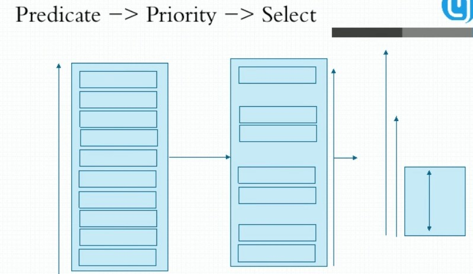

[TOC]

# Scheduling and Eviction

调度和驱逐，这里涉及 Pod Cost开销(资源限制)、调度策略、污点和容忍度、节点选择器、节点亲和性、Pod亲和性

## Pod 资源限制

容器的资源需求，资源限制：
- requests: 需求，最低保障；
- limits: 限制，硬限制
- limits >= requets

CPU:

- 1颗逻辑CPU
- 1=1000，millicores ,一个逻辑CPU是1000毫核
- 500m=0.5CPU

内存：
     E、P、T、G、M、K
     Ei、Pi

Qos：服务质量（设置了request和limits会自动归类）

- Guranteed:  同时设置CPU和内存的requests和limits。设置了一样的值，这种优先级最高
- Burstable: 至少有一个容器设置了CPU或内存资源的requests属性，中等优先级
- BestEffort: 没有任何一个容器设置了 requests或 limits属性，最低优先级别（如果节点不够会优先杀掉Pod以腾出空间）

```shell
cat > vim pod-demo.yaml <<EOF
apiVersion: v1
kind: Pod
metadata:
  name: myapp
  namespace: default
spec:
  containers:
  - name: myapp
    image: ikubernetes/stress-ng
    command: ["/usr/bin/stress-ng","-c 1","--metrics-brief"]
    imagePullPolicy: IfNotPresent
    resources:
      requests:
        cpu: "200m"
        memory: "128Mi"
      limits:
        cpu: "500m"
        memory: "512Mi"
EOF

# 假如4颗逻辑CPU，那么CPU就是用了12.5%
```

## Scheduler 调度器

*调度* 是指将 Pod 放置到合适的 Node 上，然后对应 Node 上的 Kubelet才能够运行这些 pod

**调度过程**



kube-scheduler 给一个 pod 做调度选择包含三个步骤：

1. 过滤：主要是通过 [Predicates 预选策略](https://kubernetes.io/docs/reference/scheduling/policies/#predicates) 预选出符合 Pod 的资源请求
2. 打分：主要是通过 [Priorities 优先策略](https://kubernetes.io/docs/reference/scheduling/policies/#priorities) 在几个符合预选的 Node 中优先选取出最合适的 Node
3. Select  选定最合适节点进行调度


过滤阶段会将所有满足 Pod 调度需求的 Node 选出来。 例如，PodFitsResources 过滤函数会检查候选 Node 的可用资源能否满足 Pod 的资源请求。 在过滤之后，得出一个 Node 列表，里面包含了所有可调度节点；通常情况下， 这个 Node 列表包含不止一个 Node。如果这个列表是空的，代表这个 Pod 不可调度。

在打分阶段，调度器会为 Pod 从所有可调度节点中选取一个最合适的 Node。 根据当前启用的打分规则，调度器会给每一个可调度节点进行打分。

最后，kube-scheduler 会将 Pod 调度到得分最高的 Node 上。 如果存在多个得分最高的 Node，kube-scheduler 会从中随机选取一个。


## NodeSelector

`nodeSelector` 是节点选择约束的最简单推荐形式。`nodeSelector` 是 PodSpec 的一个字段。 它包含键值对的映射。为了使 pod 可以在某个节点上运行，该节点的标签中 必须包含这里的每个键值对（它也可以具有其他标签）。 最常见的用法的是一对键值对。

[内置标签](https://kubernetes.io/zh/docs/concepts/scheduling-eviction/assign-pod-node/#built-in-node-labels)

```shell
# 给 node 打上标签
kubectl label nodes docker-k8s01 disktype=ssd
kubectl get nodes --show-labels
kubectl describe node docker-k8s01

# 去除 label
kubectl label nodes docker-k8s01 disktype=ssd-


# 把 pod 绑定到打有便签的 node 上
cat > pod-demo.yaml <<EOF
apiVersion: v1
kind: Pod
metadata:
  name: myapp
  namespace: default
spec:
  containers:
  - name: myapp
    image: ikubernetes/myapp:v1
    imagePullPolicy: IfNotPresent
    ports:
    - containerPort: 80
      protocol: TCP
  nodeSelector:
    disktype: ssd
EOF
# 如果node上没有disktype的标签那么Pod将处于pending状态
```


## Affinity and anti-affinity

`nodeSelector` 提供了一种非常简单的方法来将 Pod 约束到具有特定标签的节点上。 亲和性/反亲和性功能极大地扩展了你可以表达约束的类型。关键的增强点包括：

1. 语言更具表现力（不仅仅是“对完全匹配规则的 AND”）
2. 你可以发现规则是“软需求”/“偏好”，而不是硬性要求，因此， 如果调度器无法满足该要求，仍然调度该 Pod
3. 你可以使用节点上（或其他拓扑域中）的 Pod 的标签来约束，而不是使用 节点本身的标签，来允许哪些 pod 可以或者不可以被放置在一起。

亲和性功能包含两种类型的亲和性，即“节点亲和性”和“Pod 间亲和性/反亲和性”。 节点亲和性就像现有的 `nodeSelector`（但具有上面列出的前两个好处），然而 Pod 间亲和性/反亲和性约束 Pod 标签而不是节点标签（在上面列出的第三项中描述， 除了具有上面列出的第一和第二属性）


### Node Affinity

节点亲和性概念上类似于 `nodeSelector`，它使你可以根据节点上的标签来约束 Pod 可以调度到哪些节点。

目前有两种类型的节点亲和性，分别为 `requiredDuringSchedulingIgnoredDuringExecution` 和 `preferredDuringSchedulingIgnoredDuringExecution`。 你可以视它们为“硬需求”和“软需求”，意思是，前者指定了将 Pod 调度到一个节点上 *必须*满足的规则（就像 `nodeSelector` 但使用更具表现力的语法）， 后者指定调度器将尝试执行但不能保证的*偏好*。 名称的“IgnoredDuringExecution”部分意味着，类似于 `nodeSelector` 的工作原理， 如果节点的标签在运行时发生变更，从而不再满足 Pod 上的亲和性规则，那么 Pod 将仍然继续在该节点上运行。 将来我们计划提供 `requiredDuringSchedulingRequiredDuringExecution`， 它将类似于 `requiredDuringSchedulingIgnoredDuringExecution`， 除了它会将 pod 从不再满足 pod 的节点亲和性要求的节点上驱逐。

因此，`requiredDuringSchedulingIgnoredDuringExecution` 的示例将是 “仅将 Pod 运行在具有 Intel CPU 的节点上”，而 `preferredDuringSchedulingIgnoredDuringExecution` 的示例为 “尝试将这组 Pod 运行在 XYZ 故障区域，如果这不可能的话，则允许一些 Pod 在其他地方运行”。

节点亲和性通过 PodSpec 的 `affinity` 字段下的 `nodeAffinity` 字段进行指定。

- 硬亲和一定要符合，不然Pod会pending
- 软亲和不是必须要符合，不符合的话也可以在其他节点运行

```shell
# 硬亲和性 requiredDuringSchedulingIgnoredDuringExecution
cat > pods/pod-with-node-affinity.yaml <<EOF
apiVersion: v1
kind: Pod
metadata:
  name: with-node-affinity
spec:
  affinity:
    nodeAffinity:
      requiredDuringSchedulingIgnoredDuringExecution:  # 硬亲和
        nodeSelectorTerms:
        - matchExpressions:
          - key: kubernetes.io/e2e-az-name  # 这个是运行商特有的标签
            operator: In
            values:
            - e2e-az1
            - e2e-az2
      preferredDuringSchedulingIgnoredDuringExecution: # 软亲和
      - weight: 1
        preference:
          matchExpressions:
          - key: another-node-label-key
            operator: In
            values:
            - another-node-label-value
  containers:
  - name: with-node-affinity
    image: k8s.gcr.io/pause:2.0
EOF
```


### Pod Affinity

Pod 间亲和性与反亲和性使你可以 *基于已经在节点上运行的 Pod 的标签* 来约束 Pod 可以调度到的节点，而不是基于节点上的标签。 规则的格式为“如果 X 节点上已经运行了一个或多个 满足规则 Y 的 Pod， 则这个 Pod 应该（或者在反亲和性的情况下不应该）运行在 X 节点”。 Y 表示一个具有可选的关联命令空间列表的 LabelSelector； 与节点不同，因为 Pod 是命名空间限定的（因此 Pod 上的标签也是命名空间限定的）， 因此作用于 Pod 标签的标签选择算符必须指定选择算符应用在哪个命名空间。 从概念上讲，X 是一个拓扑域，如节点、机架、云供应商可用区、云供应商地理区域等。 你可以使用 `topologyKey` 来表示它，`topologyKey` 是节点标签的键以便系统 用来表示这样的拓扑域。根据第一个Pod，来判定第二个Pod运行在哪，就要定义亲和性和反亲和性了

> **说明：**
>
> Pod 间亲和性与反亲和性需要大量的处理，这可能会显著减慢大规模集群中的调度。 我们不建议在超过数百个节点的集群中使用它们。

> **说明：**
>
> Pod 反亲和性需要对节点进行一致的标记，即集群中的每个节点必须具有适当的标签能够匹配 `topologyKey`。如果某些或所有节点缺少指定的 `topologyKey` 标签，可能会导致意外行为。

与节点亲和性一样，当前有两种类型的 Pod 亲和性与反亲和性，即 `requiredDuringSchedulingIgnoredDuringExecution` 和 `preferredDuringSchedulingIgnoredDuringExecution`，分别表示“硬性”与“软性”要求。 请参阅前面节点亲和性部分中的描述。 `requiredDuringSchedulingIgnoredDuringExecution` 亲和性的一个示例是 “将服务 A 和服务 B 的 Pod 放置在同一区域，因为它们之间进行大量交流”，而 `preferredDuringSchedulingIgnoredDuringExecution` 反亲和性的示例将是 “将此服务的 pod 跨区域分布”（硬性要求是说不通的，因为你可能拥有的 Pod 数多于区域数）。

Pod 间亲和性通过 PodSpec 中 `affinity` 字段下的 `podAffinity` 字段进行指定。 而 Pod 间反亲和性通过 PodSpec 中 `affinity` 字段下的 `podAntiAffinity` 字段进行指定。

`kubectl explain pods.spec.affinity.podAffinity.requiredDuringSchedulingIgnoredDuringExecution`

```shell
cat > pods/pod-with-pod-affinity.yaml <<EOF
apiVersion: v1
kind: Pod
metadata:
  name: with-pod-affinity
spec:
  affinity:
    podAffinity:
      requiredDuringSchedulingIgnoredDuringExecution:
      - labelSelector:
          matchExpressions:
          - key: security
            operator: In
            values:
            - S1
        topologyKey: topology.kubernetes.io/zone
    podAntiAffinity:
      preferredDuringSchedulingIgnoredDuringExecution:
      - weight: 100
        podAffinityTerm:
          labelSelector:
            matchExpressions:
            - key: security
              operator: In
              values:
              - S2
          topologyKey: topology.kubernetes.io/zone
  containers:
  - name: with-pod-affinity
    image: k8s.gcr.io/pause:2.0

EOF
```


##  Taint & Toleration

[REFERENCE](https://kubernetes.io/zh/docs/concepts/scheduling-eviction/taint-and-toleration/)

适用下面场景：

- 在不同的机房，在不同的城市
- 有着不一样的配置（GPU服务器，或者固态硬盘的服务器）

污点和容忍的理念：

  Taint 在一类服务器上打上污点，让不能容忍这个污点的 Pod 不能部署在打了污点的服务器上。比如 Master 节点不应该部署系统 Pod 之外的任何 Pod。每个节点可以打很多个污点。一个节点定义了污点，一个pod能否调度的上来，需要检测污点和可容忍污点。污点和容忍度（Toleration）相互配合，可以用来避免 Pod 被分配到不合适的节点上。 每个节点上都可以应用一个或多个污点，这表示对于那些不能容忍这些污点的 Pod，是不会被该节点接受的。容忍度（Tolerations）是应用于 Pod 上的，允许（但并不要求）Pod 调度到带有与之匹配的污点的节点上。

taint 的 effect 定义对 pod 排斥效果：
- NoSchedule(仅影响调度过程，对现有的Pod对象不产生影响)
- NoExecute(既影响调度过程，也影响现有的Pod对象；不容忍的Pod对象将被驱逐)
- PreferNoSchedule(没有节点可以调度，也可以调度此节点)，尽量避免调度到此节点

`operator` 的默认值是 `Equal`。

一个容忍度和一个污点相“匹配”是指它们有一样的键名和效果，并且：

- 如果 `operator` 是 `Exists` （此时容忍度不能指定 `value`）
- 如果 `operator` 是 `Equal` ，则它们的 `value` 应该相等

```shell
# 给节点打上污点
kubectl taint nodes node1 key1=value1:NoSchedule

kubectl taint node docker-k8s-03 node-type=production:NoSchedule

# 去除污点
kubectl taint node docker-k8s-03 node-type-
kubectl taint node docker-k8s-03 node-type:NoSchedule- # 去除单个污点，如果有多个污点

cat > vim pod-demo.yaml <<EOF
apiVersion: v1
kind: Pod
metadata:
  name: nginx
  labels:
    env: test
spec:
  containers:
  - name: nginx
    image: nginx
    imagePullPolicy: IfNotPresent
  tolerations:
  - key: "node-type"  # node-type=production的效果是NoSchedule 可以容忍
    operator: "Equal"
    value: "production"
    effect: "NoSchedule"
  - key: "node-type"
    operator: "Exists"  # 如果 Exists 不能设置 value
    effect: "NoSchedule"
EOF
# 存在两种特殊情况：1. 如果一个 tolerations 的 `key` 为空且 operator 为 `Exists`， 表示这个容忍度与任意的 key 、value 和 effect 都匹配，即这个 tolerations 能容忍任意 taint。2. 如果 `effect` 为空，则可以与所有键名 `key1` 的效果相匹配。


# 如果给一个节点添加了一个 effect 值为 `NoExecute` 的污点， 则任何不能忍受这个污点的 Pod 都会马上被驱逐， 任何可以忍受这个污点的 Pod 都不会被驱逐。 但是，如果 Pod 存在一个 effect 值为 `NoExecute` 的容忍度指定了可选属性 `tolerationSeconds` 的值，则表示在给节点添加了上述污点之后， Pod 还能继续在节点上运行的时间
tolerations:
- key: "key1"
  operator: "Equal"
  value: "value1"
  effect: "NoExecute"
  tolerationSeconds: 3600
```


